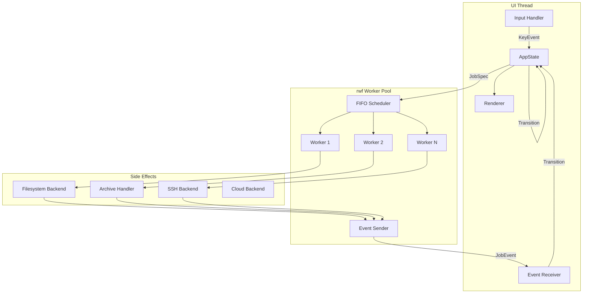
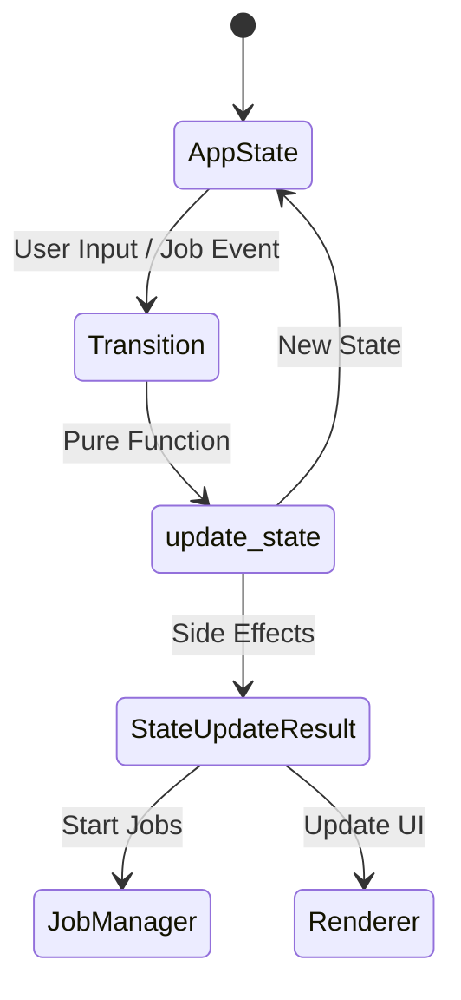
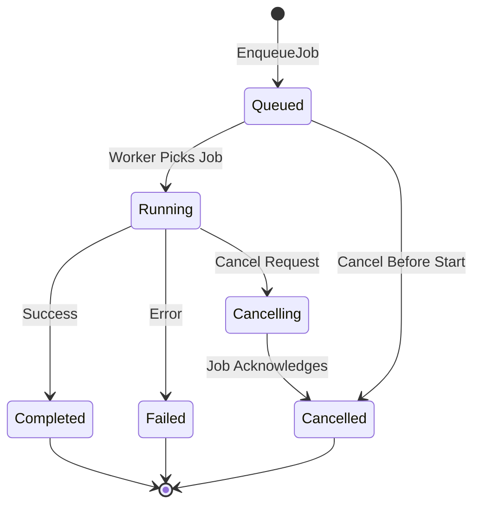

# Design Document: Two-Pane File Manager

## Overview

This document specifies the detailed design for a cross-platform, two-pane file manager built in Rust. The application provides a terminal-based user interface with dual panes for efficient file navigation and operations, leveraging the Reactive Worker Framework (rwf) for asynchronous file operations and following the AppState architectural pattern for predictable state management.

### Core Design Principles

1. **Never Block the UI Thread**: All file I/O operations execute as Jobs in the rwf Worker Pool
2. **Explicit State Transitions**: All state changes occur through the Transition enum
3. **Pure State Logic**: State transformations are pure functions returning StateUpdateResult
4. **Event-Driven Architecture**: JobEvents flow from Worker Pool to UI thread via channels
5. **FIFO Job Ordering**: Strict first-in-first-out job execution
6. **Cooperative Cancellation**: Jobs check cancellation tokens periodically
7. **Separation of Concerns**: Clear boundaries between state, side effects, and rendering

### Key Features

- Dual-pane directory browsing with independent navigation
- Tab management with per-tab pane states with busy indicators
- Asynchronous file operations (copy, move, delete, rename) with job manager
- Custom functions with macro expansion and PipeToAction directives
- Archive browsing with virtual folder navigation
- Advanced search with wildcards, regex, and migemo support
- Registered folders with environment variable expansion (%, $, ${}, $env:)
- Multiple display modes (1-8 columns, detailed view)
- Text/hex viewer with encoding support and configurable keybindings
- Pattern-based batch rename
- File comparison and split/join operations
- Advanced marking (wildcard, range, invert)
- Directory size calculation as background jobs
- Configuration reload without restart (Shift+Z)
- Session state persistence with tab restoration
- Pane synchronization (SyncPanes, SwapPanes)
- Drive/share selection dialog
- Context menu support
- File information display
- Multi-language help system
- Exit and change directory (shell integration)
- Configurable logging with rotation
- Task panel with scrollable history and resizing

## Architecture

### High-Level System Architecture



### State Management Flow



### Job Lifecycle



## Core Data Structures

### AppState

The central application state coordinating all components:

```rust
pub struct AppState {
    // Domain State
    pub tabs: TabManager,
    pub jobs: JobManager,
    pub search: SearchModel,
    pub marking: MarkingModel,
    
    // UI State
    pub ui: UIState,
    pub dialogs: DialogStack,
    
    // Backend State (Pure Data)
    pub backends: BackendStatus,
    
    // Configuration
    pub config: AppConfig,
}

impl AppState {
    pub fn new(config: AppConfig) -> Self {
        Self {
            tabs: TabManager::new(),
            jobs: JobManager::new(config.worker_pool_size),
            search: SearchModel::new(),
            marking: MarkingModel::new(),
            ui: UIState::new(),
            dialogs: DialogStack::new(),
            backends: BackendStatus::new(),
            config,
        }
    }
    
    pub fn current_tab(&self) -> &TabState {
        &self.tabs.tabs[self.tabs.active_index]
    }
    
    pub fn current_tab_mut(&mut self) -> &mut TabState {
        &mut self.tabs.tabs[self.tabs.active_index]
    }
    
    pub fn active_pane(&self) -> &PaneModel {
        let tab = self.current_tab();
        match self.ui.active_pane {
            ActivePane::Left => &tab.left_pane,
            ActivePane::Right => &tab.right_pane,
        }
    }
    
    pub fn active_pane_mut(&mut self) -> &mut PaneModel {
        let tab = self.current_tab_mut();
        match self.ui.active_pane {
            ActivePane::Left => &mut tab.left_pane,
            ActivePane::Right => &mut tab.right_pane,
        }
    }
    
    pub fn opposite_pane(&self) -> &PaneModel {
        let tab = self.current_tab();
        match self.ui.active_pane {
            ActivePane::Left => &tab.right_pane,
            ActivePane::Right => &tab.left_pane,
        }
    }
}
```

### TabManager

Manages multiple tabs with independent pane states:

```rust
pub struct TabManager {
    pub tabs: Vec<TabState>,
    pub active_index: usize,
}

impl TabManager {
    pub fn new() -> Self {
        let initial_tab = TabState::new(0);
        Self {
            tabs: vec![initial_tab],
            active_index: 0,
        }
    }
    
    pub fn create_tab(&mut self) -> usize {
        let new_id = self.tabs.len();
        let new_tab = TabState::new(new_id);
        self.tabs.push(new_tab);
        new_id
    }
    
    pub fn close_tab(&mut self, index: usize) -> bool {
        if self.tabs.len() <= 1 {
            return false; // Cannot close last tab
        }
        
        self.tabs.remove(index);
        
        // Adjust active index if necessary
        if self.active_index >= self.tabs.len() {
            self.active_index = self.tabs.len() - 1;
        }
        
        true
    }
    
    pub fn switch_to_next(&mut self) {
        self.active_index = (self.active_index + 1) % self.tabs.len();
    }
    
    pub fn switch_to_prev(&mut self) {
        if self.active_index == 0 {
            self.active_index = self.tabs.len() - 1;
        } else {
            self.active_index -= 1;
        }
    }
    
    pub fn has_active_jobs(&self, job_manager: &JobManager) -> Vec<bool> {
        self.tabs.iter().map(|tab| {
            job_manager.active.values().any(|job| {
                matches_tab_location(job, &tab.left_pane.current_location) ||
                matches_tab_location(job, &tab.right_pane.current_location)
            })
        }).collect()
    }
}

pub struct TabState {
    pub id: usize,
    pub left_pane: PaneModel,
    pub right_pane: PaneModel,
    pub history: NavigationHistory,
}

impl TabState {
    pub fn new(id: usize) -> Self {
        let cwd = std::env::current_dir().unwrap_or_else(|_| PathBuf::from("/"));
        Self {
            id,
            left_pane: PaneModel::new(Location::Local(cwd.clone())),
            right_pane: PaneModel::new(Location::Local(cwd)),
            history: NavigationHistory::new(),
        }
    }
}
```

### PaneModel

Represents the state of a single pane:

```rust
pub struct PaneModel {
    pub current_location: Location,
    pub entries: Vec<FileEntry>,
    pub cursor: usize,
    pub scroll_offset: usize,
    pub sort_mode: SortMode,
    pub display_mode: DisplayMode,
    pub file_mask: Option<String>,
}

impl PaneModel {
    pub fn new(location: Location) -> Self {
        Self {
            current_location: location,
            entries: Vec::new(),
            cursor: 0,
            scroll_offset: 0,
            sort_mode: SortMode::Name,
            display_mode: DisplayMode::Detailed,
            file_mask: None,
        }
    }
    
    pub fn current_entry(&self) -> Option<&FileEntry> {
        self.entries.get(self.cursor)
    }
    
    pub fn marked_entries(&self) -> Vec<&FileEntry> {
        self.entries.iter().filter(|e| e.marked).collect()
    }
    
    pub fn apply_sort(&mut self) {
        self.entries.sort_by(|a, b| {
            // Directories always come first
            match (a.is_dir, b.is_dir) {
                (true, false) => std::cmp::Ordering::Less,
                (false, true) => std::cmp::Ordering::Greater,
                _ => match self.sort_mode {
                    SortMode::Name => a.name.cmp(&b.name),
                    SortMode::Size => a.size.cmp(&b.size),
                    SortMode::Date => a.modified.cmp(&b.modified),
                    SortMode::Extension => {
                        let ext_a = Path::new(&a.name).extension().and_then(|s| s.to_str()).unwrap_or("");
                        let ext_b = Path::new(&b.name).extension().and_then(|s| s.to_str()).unwrap_or("");
                        ext_a.cmp(ext_b)
                    }
                }
            }
        });
    }
    
    pub fn apply_filter(&mut self, mask: &str) {
        // Filter logic would be applied here
        // This is a placeholder for the actual implementation
    }
}

#[derive(Debug, Clone, Copy, PartialEq)]
pub enum SortMode {
    Name,
    Size,
    Date,
    Extension,
}

#[derive(Debug, Clone, Copy, PartialEq)]
pub enum DisplayMode {
    Columns(u8), // 1-8 columns
    Detailed,    // Full metadata view
}
```

### Location

Abstract representation of file locations:

```rust
#[derive(Debug, Clone, PartialEq, Eq, Hash)]
pub enum Location {
    Local(PathBuf),
    Ssh {
        host: String,
        port: u16,
        path: PathBuf,
    },
    Cloud {
        provider: String,
        bucket: String,
        path: PathBuf,
    },
    Archive {
        archive_path: Box<Location>,
        inner_path: PathBuf,
    },
}

impl Location {
    pub fn display_path(&self) -> String {
        match self {
            Location::Local(path) => path.display().to_string(),
            Location::Ssh { host, port, path } => {
                format!("ssh://{}:{}{}", host, port, path.display())
            }
            Location::Cloud { provider, bucket, path } => {
                format!("{}://{}/{}", provider, bucket, path.display())
            }
            Location::Archive { archive_path, inner_path } => {
                format!("{}#{}", archive_path.display_path(), inner_path.display())
            }
        }
    }
    
    pub fn parent(&self) -> Option<Location> {
        match self {
            Location::Local(path) => {
                path.parent().map(|p| Location::Local(p.to_path_buf()))
            }
            Location::Ssh { host, port, path } => {
                path.parent().map(|p| Location::Ssh {
                    host: host.clone(),
                    port: *port,
                    path: p.to_path_buf(),
                })
            }
            Location::Cloud { provider, bucket, path } => {
                path.parent().map(|p| Location::Cloud {
                    provider: provider.clone(),
                    bucket: bucket.clone(),
                    path: p.to_path_buf(),
                })
            }
            Location::Archive { archive_path, inner_path } => {
                if inner_path.parent().is_some() {
                    inner_path.parent().map(|p| Location::Archive {
                        archive_path: archive_path.clone(),
                        inner_path: p.to_path_buf(),
                    })
                } else {
                    // Exit archive, return to filesystem
                    Some((**archive_path).clone())
                }
            }
        }
    }
    
    pub fn join(&self, component: &str) -> Location {
        match self {
            Location::Local(path) => Location::Local(path.join(component)),
            Location::Ssh { host, port, path } => Location::Ssh {
                host: host.clone(),
                port: *port,
                path: path.join(component),
            },
            Location::Cloud { provider, bucket, path } => Location::Cloud {
                provider: provider.clone(),
                bucket: bucket.clone(),
                path: path.join(component),
            },
            Location::Archive { archive_path, inner_path } => Location::Archive {
                archive_path: archive_path.clone(),
                inner_path: inner_path.join(component),
            },
        }
    }
}
```

### FileEntry

Represents a file or directory with metadata:

```rust
#[derive(Debug, Clone)]
pub struct FileEntry {
    pub name: String,
    pub location: Location,
    pub size: u64,
    pub is_dir: bool,
    pub is_hidden: bool,
    pub modified: SystemTime,
    pub marked: bool,
    pub calculated_size: Option<u64>, // For directory size calculation
}

impl FileEntry {
    pub fn extension(&self) -> Option<&str> {
        Path::new(&self.name)
            .extension()
            .and_then(|s| s.to_str())
    }
    
    pub fn name_without_extension(&self) -> &str {
        Path::new(&self.name)
            .file_stem()
            .and_then(|s| s.to_str())
            .unwrap_or(&self.name)
    }
    
    pub fn formatted_size(&self) -> String {
        format_size(self.calculated_size.unwrap_or(self.size))
    }
    
    pub fn formatted_date(&self) -> String {
        format_date(self.modified)
    }
}

fn format_size(bytes: u64) -> String {
    const KB: u64 = 1024;
    const MB: u64 = KB * 1024;
    const GB: u64 = MB * 1024;
    const TB: u64 = GB * 1024;
    
    if bytes < KB {
        format!("{} B", bytes)
    } else if bytes < MB {
        format!("{:.2} KB", bytes as f64 / KB as f64)
    } else if bytes < GB {
        format!("{:.2} MB", bytes as f64 / MB as f64)
    } else if bytes < TB {
        format!("{:.2} GB", bytes as f64 / GB as f64)
    } else {
        format!("{:.2} TB", bytes as f64 / TB as f64)
    }
}

fn format_date(time: SystemTime) -> String {
    // Implementation would format based on config
    // For now, placeholder
    "2024-01-01 12:00".to_string()
}
```


### JobManager

Manages background job state with FIFO queue:

```rust
use std::collections::{BinaryHeap, HashMap, VecDeque};
use std::sync::Arc;
use tokio_util::sync::CancellationToken;

pub struct JobManager {
    pub queue: VecDeque<JobSpec>,  // FIFO queue
    pub active: HashMap<JobId, Job>,
    pub completed: VecDeque<JobResult>,
    pub max_parallel: usize,
    pub next_id: u64,
}

impl JobManager {
    pub fn new(max_parallel: usize) -> Self {
        Self {
            queue: VecDeque::new(),
            active: HashMap::new(),
            completed: VecDeque::new(),
            max_parallel,
            next_id: 0,
        }
    }
    
    pub fn enqueue(&mut self, mut spec: JobSpec) -> JobId {
        spec.id = JobId(self.next_id);
        self.next_id += 1;
        let id = spec.id;
        self.queue.push_back(spec);
        id
    }
    
    pub fn can_start_job(&self) -> bool {
        self.active.len() < self.max_parallel && !self.queue.is_empty()
    }
    
    pub fn pop_next_job(&mut self) -> Option<JobSpec> {
        self.queue.pop_front()
    }
    
    pub fn start_job(&mut self, spec: JobSpec) {
        let job = Job {
            spec: spec.clone(),
            state: ExecutionState::Running,
            progress: 0.0,
            started_at: Some(SystemTime::now()),
        };
        self.active.insert(spec.id, job);
    }
    
    pub fn update_progress(&mut self, job_id: JobId, progress: f64) {
        if let Some(job) = self.active.get_mut(&job_id) {
            job.progress = progress;
        }
    }
    
    pub fn complete_job(&mut self, job_id: JobId, result: OpResult) {
        if let Some(job) = self.active.remove(&job_id) {
            let job_result = JobResult {
                id: job_id,
                kind: job.spec.kind.clone(),
                completed_at: SystemTime::now(),
                result,
            };
            self.completed.push_back(job_result);
            
            // Keep only last 100 completed jobs
            if self.completed.len() > 100 {
                self.completed.pop_front();
            }
        }
    }
    
    pub fn request_cancel(&mut self, job_id: JobId) -> bool {
        // Cancel active job
        if let Some(job) = self.active.get_mut(&job_id) {
            job.spec.cancel_token.cancel();
            job.state = ExecutionState::Cancelling;
            return true;
        }
        
        // Remove from queue
        if let Some(pos) = self.queue.iter().position(|spec| spec.id == job_id) {
            let spec = self.queue.remove(pos).unwrap();
            spec.cancel_token.cancel();
            
            let job_result = JobResult {
                id: job_id,
                kind: spec.kind,
                completed_at: SystemTime::now(),
                result: OpResult::Cancelled,
            };
            self.completed.push_back(job_result);
            return true;
        }
        
        false
    }
    
    pub fn acknowledge_cancel(&mut self, job_id: JobId) {
        if let Some(job) = self.active.remove(&job_id) {
            let job_result = JobResult {
                id: job_id,
                kind: job.spec.kind,
                completed_at: SystemTime::now(),
                result: OpResult::Cancelled,
            };
            self.completed.push_back(job_result);
        }
    }
}

#[derive(Debug, Clone, Copy, PartialEq, Eq, Hash)]
pub struct JobId(pub u64);

#[derive(Debug, Clone)]
pub struct JobSpec {
    pub id: JobId,
    pub kind: JobKind,
    pub created_at: SystemTime,
    pub cancel_token: CancellationToken,
}

impl JobSpec {
    pub fn new(kind: JobKind) -> Self {
        Self {
            id: JobId(0), // Will be assigned by JobManager
            kind,
            created_at: SystemTime::now(),
            cancel_token: CancellationToken::new(),
        }
    }
}

#[derive(Debug, Clone)]
pub enum JobKind {
    ReadDirectory {
        location: Location,
    },
    Copy {
        sources: Vec<Location>,
        dest: Location,
    },
    Move {
        sources: Vec<Location>,
        dest: Location,
    },
    Delete {
        targets: Vec<Location>,
    },
    Mkdir {
        location: Location,
    },
    Rename {
        from: Location,
        to: Location,
    },
    CalculateSize {
        location: Location,
    },
    ExtractArchive {
        archive: Location,
        dest: Location,
    },
    CreateArchive {
        sources: Vec<Location>,
        dest: Location,
    },
    ExecuteCustomFunction {
        command: String,
        working_dir: Location,
        pipe_to_action: Option<PipeToAction>,
    },
    Search {
        location: Location,
        pattern: String,
        recursive: bool,
    },
}

#[derive(Debug, Clone)]
pub struct Job {
    pub spec: JobSpec,
    pub state: ExecutionState,
    pub progress: f64,
    pub started_at: Option<SystemTime>,
}

#[derive(Debug, Clone, Copy, PartialEq)]
pub enum ExecutionState {
    Running,
    Cancelling,
}

#[derive(Debug, Clone)]
pub struct JobResult {
    pub id: JobId,
    pub kind: JobKind,
    pub completed_at: SystemTime,
    pub result: OpResult,
}

#[derive(Debug, Clone)]
pub enum OpResult {
    Success(SuccessData),
    Failed(String),
    Cancelled,
}

#[derive(Debug, Clone)]
pub enum SuccessData {
    DirectoryRead(Vec<FileEntry>),
    SizeCalculated(u64),
    CustomFunctionOutput(String),
    SearchResults(Vec<FileEntry>),
    None,
}
```

### SearchModel

Manages search state:

```rust
pub struct SearchModel {
    pub query: String,
    pub results: Vec<FileEntry>,
    pub history: Vec<String>,
    pub current_index: Option<usize>,
    pub case_sensitive: bool,
    pub use_regex: bool,
    pub use_migemo: bool,
}

impl SearchModel {
    pub fn new() -> Self {
        Self {
            query: String::new(),
            results: Vec::new(),
            history: Vec::new(),
            current_index: None,
            case_sensitive: false,
            use_regex: false,
            use_migemo: false,
        }
    }
    
    pub fn add_to_history(&mut self, query: String) {
        if !query.is_empty() && !self.history.contains(&query) {
            self.history.push(query);
            if self.history.len() > 50 {
                self.history.remove(0);
            }
        }
    }
    
    pub fn matches(&self, entry: &FileEntry) -> bool {
        if self.query.is_empty() {
            return true;
        }
        
        if self.use_regex {
            // Regex matching
            if let Ok(re) = regex::Regex::new(&self.query) {
                return re.is_match(&entry.name);
            }
            false
        } else {
            // Wildcard matching
            let pattern = wildcard_to_regex(&self.query);
            if let Ok(re) = regex::Regex::new(&pattern) {
                if self.case_sensitive {
                    re.is_match(&entry.name)
                } else {
                    re.is_match(&entry.name.to_lowercase())
                }
            } else {
                false
            }
        }
    }
}

fn wildcard_to_regex(pattern: &str) -> String {
    let mut regex = String::from("^");
    for ch in pattern.chars() {
        match ch {
            '*' => regex.push_str(".*"),
            '?' => regex.push('.'),
            '.' | '+' | '(' | ')' | '[' | ']' | '{' | '}' | '^' | '$' | '|' | '\\' => {
                regex.push('\\');
                regex.push(ch);
            }
            _ => regex.push(ch),
        }
    }
    regex.push('$');
    regex
}
```

### MarkingModel

Manages file marking state:

```rust
pub struct MarkingModel {
    pub marked_locations: HashSet<Location>,
}

impl MarkingModel {
    pub fn new() -> Self {
        Self {
            marked_locations: HashSet::new(),
        }
    }
    
    pub fn toggle(&mut self, location: Location) {
        if self.marked_locations.contains(&location) {
            self.marked_locations.remove(&location);
        } else {
            self.marked_locations.insert(location);
        }
    }
    
    pub fn mark(&mut self, location: Location) {
        self.marked_locations.insert(location);
    }
    
    pub fn unmark(&mut self, location: Location) {
        self.marked_locations.remove(&location);
    }
    
    pub fn mark_all(&mut self, entries: &[FileEntry]) {
        for entry in entries {
            self.marked_locations.insert(entry.location.clone());
        }
    }
    
    pub fn unmark_all(&mut self) {
        self.marked_locations.clear();
    }
    
    pub fn is_marked(&self, location: &Location) -> bool {
        self.marked_locations.contains(location)
    }
    
    pub fn count(&self) -> usize {
        self.marked_locations.len()
    }
    
    pub fn total_size(&self, entries: &[FileEntry]) -> u64 {
        entries.iter()
            .filter(|e| self.is_marked(&e.location))
            .map(|e| e.size)
            .sum()
    }
}
```

### NavigationHistory

Manages navigation history per pane:

```rust
pub struct NavigationHistory {
    pub left_stack: Vec<Location>,
    pub right_stack: Vec<Location>,
    pub left_pos: usize,
    pub right_pos: usize,
}

impl NavigationHistory {
    pub fn new() -> Self {
        Self {
            left_stack: Vec::new(),
            right_stack: Vec::new(),
            left_pos: 0,
            right_pos: 0,
        }
    }
    
    pub fn push(&mut self, pane: ActivePane, location: Location) {
        match pane {
            ActivePane::Left => {
                // Truncate forward history
                self.left_stack.truncate(self.left_pos + 1);
                self.left_stack.push(location);
                self.left_pos = self.left_stack.len() - 1;
            }
            ActivePane::Right => {
                self.right_stack.truncate(self.right_pos + 1);
                self.right_stack.push(location);
                self.right_pos = self.right_stack.len() - 1;
            }
        }
    }
    
    pub fn go_back(&mut self, pane: ActivePane) -> Option<Location> {
        match pane {
            ActivePane::Left => {
                if self.left_pos > 0 {
                    self.left_pos -= 1;
                    self.left_stack.get(self.left_pos).cloned()
                } else {
                    None
                }
            }
            ActivePane::Right => {
                if self.right_pos > 0 {
                    self.right_pos -= 1;
                    self.right_stack.get(self.right_pos).cloned()
                } else {
                    None
                }
            }
        }
    }
    
    pub fn go_forward(&mut self, pane: ActivePane) -> Option<Location> {
        match pane {
            ActivePane::Left => {
                if self.left_pos + 1 < self.left_stack.len() {
                    self.left_pos += 1;
                    self.left_stack.get(self.left_pos).cloned()
                } else {
                    None
                }
            }
            ActivePane::Right => {
                if self.right_pos + 1 < self.right_stack.len() {
                    self.right_pos += 1;
                    self.right_stack.get(self.right_pos).cloned()
                } else {
                    None
                }
            }
        }
    }
}
```

### UIState

Manages UI state:

```rust
pub struct UIState {
    pub active_pane: ActivePane,
    pub mode: UIMode,
    pub layout: LayoutState,
}

impl UIState {
    pub fn new() -> Self {
        Self {
            active_pane: ActivePane::Left,
            mode: UIMode::Normal,
            layout: LayoutState::default(),
        }
    }
}

pub struct LayoutState {
    pub pane_split_ratio: f64,
    pub show_status_bar: bool,
    pub show_task_panel: bool,
    pub show_tab_bar: bool,
}

impl Default for LayoutState {
    fn default() -> Self {
        Self {
            pane_split_ratio: 0.5,
            show_status_bar: true,
            show_task_panel: true,
            show_tab_bar: true,
        }
    }
}

#[derive(Debug, Clone, Copy, PartialEq)]
pub enum ActivePane {
    Left,
    Right,
}

impl ActivePane {
    pub fn opposite(&self) -> Self {
        match self {
            ActivePane::Left => ActivePane::Right,
            ActivePane::Right => ActivePane::Left,
        }
    }
}

#[derive(Debug, Clone, Copy, PartialEq)]
pub enum UIMode {
    Normal,
    Search,
    Command,
    Dialog,
    Viewer,
}
```

### DialogStack

Manages dialog state:

```rust
pub struct DialogStack {
    pub stack: Vec<Dialog>,
    pub input_buffer: String,
}

impl DialogStack {
    pub fn new() -> Self {
        Self {
            stack: Vec::new(),
            input_buffer: String::new(),
        }
    }
    
    pub fn push(&mut self, dialog: Dialog) {
        self.stack.push(dialog);
        self.input_buffer.clear();
    }
    
    pub fn pop(&mut self) -> Option<Dialog> {
        self.input_buffer.clear();
        self.stack.pop()
    }
    
    pub fn current(&self) -> Option<&Dialog> {
        self.stack.last()
    }
    
    pub fn current_mut(&mut self) -> Option<&mut Dialog> {
        self.stack.last_mut()
    }
    
    pub fn is_empty(&self) -> bool {
        self.stack.is_empty()
    }
}

#[derive(Debug, Clone)]
pub struct Dialog {
    pub title: String,
    pub content: DialogContent,
    pub pending_action: Option<PendingAction>,
}

#[derive(Debug, Clone)]
pub enum DialogContent {
    Confirmation {
        message: String,
    },
    Input {
        prompt: String,
        default_value: String,
    },
    Progress {
        operation: String,
        progress: f64,
        details: String,
    },
    JobManager {
        selected_index: usize,
    },
    CustomFunctionSelector {
        functions: Vec<CustomFunction>,
        filter: String,
        selected_index: usize,
    },
    RegisteredFolderSelector {
        folders: Vec<RegisteredFolder>,
        filter: String,
        selected_index: usize,
    },
    TabSelector {
        tabs: Vec<String>,
        selected_index: usize,
    },
    PatternRename {
        pattern: String,
        preview: Vec<(String, String)>,
    },
}

#[derive(Debug, Clone)]
pub enum PendingAction {
    ConfirmCopy {
        sources: Vec<Location>,
        destination: Location,
    },
    ConfirmMove {
        sources: Vec<Location>,
        destination: Location,
    },
    ConfirmDelete {
        locations: Vec<Location>,
    },
    ExecuteRename {
        from: Location,
        to: String,
    },
    ExecuteSearch {
        query: String,
    },
    ExecuteCustomFunction {
        function: CustomFunction,
    },
    NavigateToRegisteredFolder {
        folder: RegisteredFolder,
    },
    SwitchToTab {
        index: usize,
    },
    ExecutePatternRename {
        pattern: String,
        targets: Vec<Location>,
    },
}
```

### BackendStatus

Manages backend connection state (pure data):

```rust
pub struct BackendStatus {
    pub ssh_connections: HashMap<String, ConnectionStatus>,
    pub cloud_providers: HashMap<String, ProviderStatus>,
    pub archive_sessions: HashMap<PathBuf, ArchiveStatus>,
}

impl BackendStatus {
    pub fn new() -> Self {
        Self {
            ssh_connections: HashMap::new(),
            cloud_providers: HashMap::new(),
            archive_sessions: HashMap::new(),
        }
    }
}

#[derive(Debug, Clone)]
pub enum ConnectionStatus {
    Connected,
    Connecting,
    Disconnected,
    Error(String),
}

#[derive(Debug, Clone)]
pub enum ProviderStatus {
    Authenticated,
    Authenticating,
    NeedsAuth,
    Error(String),
}

#[derive(Debug, Clone)]
pub enum ArchiveStatus {
    Open,
    Closed,
    Error(String),
}
```

### AppConfig

Manages application configuration:

```rust
use serde::{Deserialize, Serialize};

#[derive(Debug, Clone, Serialize, Deserialize)]
pub struct AppConfig {
    pub display: DisplayConfig,
    pub key_bindings: KeyBindings,
    pub file_operations: FileOpConfig,
    pub search: SearchConfig,
    pub ui: UIConfig,
    pub worker_pool_size: usize,
    pub log_level: LogLevel,
    pub session_persistence: bool,
}

impl Default for AppConfig {
    fn default() -> Self {
        Self {
            display: DisplayConfig::default(),
            key_bindings: KeyBindings::default(),
            file_operations: FileOpConfig::default(),
            search: SearchConfig::default(),
            ui: UIConfig::default(),
            worker_pool_size: 4,
            log_level: LogLevel::Info,
            session_persistence: true,
        }
    }
}

#[derive(Debug, Clone, Serialize, Deserialize)]
pub struct DisplayConfig {
    pub show_hidden: bool,
    pub show_system: bool,
    pub date_format: String,
    pub time_format: TimeFormat,
    pub cjk_width: u8,
    pub colors: ColorScheme,
}

impl Default for DisplayConfig {
    fn default() -> Self {
        Self {
            show_hidden: false,
            show_system: false,
            date_format: "%Y-%m-%d %H:%M".to_string(),
            time_format: TimeFormat::TwentyFourHour,
            cjk_width: 2,
            colors: ColorScheme::default(),
        }
    }
}

#[derive(Debug, Clone, Copy, Serialize, Deserialize)]
pub enum TimeFormat {
    TwentyFourHour,
    TwelveHour,
}

#[derive(Debug, Clone, Serialize, Deserialize)]
pub struct ColorScheme {
    // Main UI colors
    pub foreground_color: String,
    pub background_color: String,
    pub highlight_foreground_color: String,
    pub highlight_background_color: String,
    
    // File and directory colors
    pub marked_file_color: String,
    pub directory_color: String,
    pub directory_background_color: String,
    pub inactive_directory_color: String,
    pub inactive_directory_background_color: String,
    
    // Pane and border colors
    pub filename_label_foreground_color: String,
    pub filename_label_background_color: String,
    pub pane_border_color: String,
    
    // Top separator colors
    pub top_separator_foreground_color: String,
    pub top_separator_background_color: String,
    
    // Dialog colors
    pub dialog_help_foreground_color: String,
    pub dialog_help_background_color: String,
    
    // Tab colors
    pub active_tab_foreground_color: String,
    pub active_tab_background_color: String,
    pub inactive_tab_foreground_color: String,
    pub inactive_tab_background_color: String,
    pub tabbar_background_color: String,
    
    // Status colors
    pub ok_color: String,
    pub warning_color: String,
    pub error_color: String,
    
    // Text viewer colors
    pub text_viewer_foreground_color: String,
    pub text_viewer_background_color: String,
    pub text_viewer_status_foreground_color: String,
    pub text_viewer_status_background_color: String,
    pub text_viewer_message_foreground_color: String,
    pub text_viewer_message_background_color: String,
}

impl Default for ColorScheme {
    fn default() -> Self {
        // TWF-compatible defaults
        Self {
            foreground_color: "White".to_string(),
            background_color: "Black".to_string(),
            highlight_foreground_color: "Black".to_string(),
            highlight_background_color: "Cyan".to_string(),
            marked_file_color: "Cyan".to_string(),
            directory_color: "BrightCyan".to_string(),
            directory_background_color: "Black".to_string(),
            inactive_directory_color: "Cyan".to_string(),
            inactive_directory_background_color: "Black".to_string(),
            filename_label_foreground_color: "White".to_string(),
            filename_label_background_color: "Blue".to_string(),
            pane_border_color: "Red".to_string(),
            top_separator_foreground_color: "Black".to_string(),
            top_separator_background_color: "Gray".to_string(),
            dialog_help_foreground_color: "BrightYellow".to_string(),
            dialog_help_background_color: "Blue".to_string(),
            active_tab_foreground_color: "White".to_string(),
            active_tab_background_color: "Blue".to_string(),
            inactive_tab_foreground_color: "Gray".to_string(),
            inactive_tab_background_color: "Black".to_string(),
            tabbar_background_color: "Black".to_string(),
            ok_color: "Green".to_string(),
            warning_color: "Yellow".to_string(),
            error_color: "Red".to_string(),
            text_viewer_foreground_color: "White".to_string(),
            text_viewer_background_color: "Black".to_string(),
            text_viewer_status_foreground_color: "White".to_string(),
            text_viewer_status_background_color: "Gray".to_string(),
            text_viewer_message_foreground_color: "White".to_string(),
            text_viewer_message_background_color: "Blue".to_string(),
        }
    }
}

#[derive(Debug, Clone, Serialize, Deserialize)]
pub struct KeyBindings {
    pub normal_mode: HashMap<String, Action>,
    pub search_mode: HashMap<String, Action>,
    pub dialog_mode: HashMap<String, Action>,
    pub viewer_mode: HashMap<String, Action>,
}

impl Default for KeyBindings {
    fn default() -> Self {
        // TWF-compatible defaults
        let mut normal_mode = HashMap::new();
        normal_mode.insert("Tab".to_string(), Action::SwitchPane);
        normal_mode.insert("Up".to_string(), Action::CursorUp);
        normal_mode.insert("Down".to_string(), Action::CursorDown);
        normal_mode.insert("k".to_string(), Action::CursorUp);
        normal_mode.insert("j".to_string(), Action::CursorDown);
        normal_mode.insert("Enter".to_string(), Action::EnterDirectory);
        normal_mode.insert("Backspace".to_string(), Action::ParentDirectory);
        normal_mode.insert("Space".to_string(), Action::ToggleMark);
        normal_mode.insert("*".to_string(), Action::MarkAll);
        normal_mode.insert("Ctrl+U".to_string(), Action::UnmarkAll);
        normal_mode.insert("C".to_string(), Action::Copy);
        normal_mode.insert("M".to_string(), Action::Move);
        normal_mode.insert("D".to_string(), Action::Delete);
        normal_mode.insert("R".to_string(), Action::Rename);
        normal_mode.insert("Shift+K".to_string(), Action::CreateDirectory);
        normal_mode.insert("Q".to_string(), Action::Quit);
        normal_mode.insert("Escape".to_string(), Action::Quit);
        
        Self {
            normal_mode,
            search_mode: HashMap::new(),
            dialog_mode: HashMap::new(),
            viewer_mode: HashMap::new(),
        }
    }
}

#[derive(Debug, Clone, Serialize, Deserialize)]
pub enum Action {
    // Navigation
    CursorUp,
    CursorDown,
    CursorLeft,
    CursorRight,
    PageUp,
    PageDown,
    Home,
    End,
    EnterDirectory,
    ParentDirectory,
    SwitchPane,
    
    // File Operations
    Copy,
    Move,
    Delete,
    Rename,
    CreateDirectory,
    
    // Marking
    ToggleMark,
    MarkAll,
    UnmarkAll,
    MarkPattern,
    MarkRange,
    InvertMarks,
    
    // Search
    StartSearch,
    NextMatch,
    PrevMatch,
    ClearSearch,
    
    // View
    ChangeDisplayMode(u8),
    ChangeSortMode,
    ToggleHidden,
    Refresh,
    
    // Tabs
    NewTab,
    CloseTab,
    NextTab,
    PrevTab,
    TabSelector,
    
    // Advanced
    CustomFunction,
    RegisteredFolders,
    JobManager,
    ViewFile,
    HexView,
    CompareFiles,
    
    // Application
    Quit,
    ReloadConfig,
}

#[derive(Debug, Clone, Serialize, Deserialize)]
pub struct FileOpConfig {
    pub confirm_delete: bool,
    pub confirm_overwrite: bool,
    pub buffer_size: usize,
    pub preserve_timestamps: bool,
}

impl Default for FileOpConfig {
    fn default() -> Self {
        Self {
            confirm_delete: true,
            confirm_overwrite: true,
            buffer_size: 8192,
            preserve_timestamps: true,
        }
    }
}

#[derive(Debug, Clone, Serialize, Deserialize)]
pub struct SearchConfig {
    pub case_sensitive: bool,
    pub use_regex: bool,
    pub use_migemo: bool,
    pub max_results: usize,
}

impl Default for SearchConfig {
    fn default() -> Self {
        Self {
            case_sensitive: false,
            use_regex: false,
            use_migemo: false,
            max_results: 1000,
        }
    }
}

#[derive(Debug, Clone, Serialize, Deserialize)]
pub struct UIConfig {
    pub refresh_rate: u64,
    pub scroll_offset: usize,
    pub tab_width: usize,
}

impl Default for UIConfig {
    fn default() -> Self {
        Self {
            refresh_rate: 30,
            scroll_offset: 3,
            tab_width: 4,
        }
    }
}

#[derive(Debug, Clone, Copy, Serialize, Deserialize)]
pub enum LogLevel {
    None,
    Trace,
    Debug,
    Info,
    Warning,
    Error,
    Critical,
}
```


## State Transition System

### Transition Enum

All state changes occur through explicit transitions:

```rust
#[derive(Debug, Clone)]
pub enum Transition {
    // Navigation
    CursorMove { pane: ActivePane, delta: isize },
    CursorJump { pane: ActivePane, position: usize },
    ChangeLocation { pane: ActivePane, location: Location },
    NavigateUp { pane: ActivePane },
    NavigateHistory { pane: ActivePane, direction: HistoryDirection },
    SwitchPane,
    
    // Tab Management
    CreateTab,
    CloseTab { index: usize },
    SwitchTab { index: usize },
    NextTab,
    PrevTab,
    
    // Job Operations
    EnqueueJob { spec: JobSpec },
    StartNextJob,
    UpdateJobProgress { job_id: JobId, progress: f64 },
    CompleteJob { job_id: JobId, result: OpResult },
    CancelJob { job_id: JobId },
    AcknowledgeCancel { job_id: JobId },
    
    // View Operations
    ChangeSortMode { pane: ActivePane, mode: SortMode },
    ChangeDisplayMode { pane: ActivePane, mode: DisplayMode },
    SetFileMask { pane: ActivePane, mask: Option<String> },
    ToggleHidden,
    Refresh { pane: ActivePane },
    RefreshAndClearMarks { pane: ActivePane },
    RefreshNoClearMarks { pane: ActivePane },
    
    // Pane Operations
    SyncPanes,
    SwapPanes,
    
    // Marking Operations
    ToggleMark { location: Location },
    MarkAll,
    UnmarkAll,
    MarkPattern { pattern: String },
    MarkRange { start: usize, end: usize },
    InvertMarks,
    
    // Search Operations
    StartSearch { query: String },
    UpdateSearchResults { results: Vec<FileEntry> },
    NextSearchResult,
    PrevSearchResult,
    ClearSearch,
    
    // UI Operations
    ChangeUIMode { mode: UIMode },
    ShowDialog { dialog: Dialog },
    CloseDialog,
    UpdateDialogInput { input: String },
    ConfirmDialog,
    CancelDialog,
    ShowContextMenu,
    ShowDriveChangeDialog,
    ShowFileInfo,
    ShowVersion,
    SaveLog,
    LaunchConfigurationProgram,
    
    // Configuration
    ReloadConfig,
    UpdateConfig { config: AppConfig },
    
    // Application Control
    Quit,
    ExitAndChangeDirectory,
}

#[derive(Debug, Clone, Copy)]
pub enum HistoryDirection {
    Back,
    Forward,
}
```

### StateUpdateResult

Result of applying a transition:

```rust
pub struct StateUpdateResult {
    pub started_jobs: Vec<JobSpec>,
    pub ui_changed: bool,
    pub needs_refresh: Vec<ActivePane>,
}

impl StateUpdateResult {
    pub fn none() -> Self {
        Self {
            started_jobs: Vec::new(),
            ui_changed: false,
            needs_refresh: Vec::new(),
        }
    }
    
    pub fn with_job(job: JobSpec) -> Self {
        Self {
            started_jobs: vec![job],
            ui_changed: true,
            needs_refresh: Vec::new(),
        }
    }
    
    pub fn with_ui_change() -> Self {
        Self {
            started_jobs: Vec::new(),
            ui_changed: true,
            needs_refresh: Vec::new(),
        }
    }
    
    pub fn with_refresh(pane: ActivePane) -> Self {
        Self {
            started_jobs: Vec::new(),
            ui_changed: true,
            needs_refresh: vec![pane],
        }
    }
}
```

### State Update Function

The core state transformation function:

```rust
pub fn update_state(state: &mut AppState, transition: Transition) -> StateUpdateResult {
    match transition {
        Transition::CursorMove { pane, delta } => {
            let tab = state.current_tab_mut();
            let pane_model = match pane {
                ActivePane::Left => &mut tab.left_pane,
                ActivePane::Right => &mut tab.right_pane,
            };
            
            if !pane_model.entries.is_empty() {
                let new_cursor = (pane_model.cursor as isize + delta)
                    .max(0)
                    .min(pane_model.entries.len() as isize - 1) as usize;
                pane_model.cursor = new_cursor;
                
                // Adjust scroll if needed
                let visible_height = 20; // Would come from layout
                if pane_model.cursor < pane_model.scroll_offset {
                    pane_model.scroll_offset = pane_model.cursor;
                } else if pane_model.cursor >= pane_model.scroll_offset + visible_height {
                    pane_model.scroll_offset = pane_model.cursor - visible_height + 1;
                }
            }
            
            StateUpdateResult::with_ui_change()
        }
        
        Transition::SwitchPane => {
            state.ui.active_pane = state.ui.active_pane.opposite();
            StateUpdateResult::with_ui_change()
        }
        
        Transition::ChangeLocation { pane, location } => {
            let tab = state.current_tab_mut();
            
            // Add to history
            let current_location = match pane {
                ActivePane::Left => tab.left_pane.current_location.clone(),
                ActivePane::Right => tab.right_pane.current_location.clone(),
            };
            tab.history.push(pane, current_location);
            
            // Update location
            let pane_model = match pane {
                ActivePane::Left => &mut tab.left_pane,
                ActivePane::Right => &mut tab.right_pane,
            };
            pane_model.current_location = location.clone();
            pane_model.cursor = 0;
            pane_model.scroll_offset = 0;
            
            // Create job to read directory
            let job_spec = JobSpec::new(JobKind::ReadDirectory { location });
            StateUpdateResult::with_job(job_spec)
        }
        
        Transition::NavigateUp { pane } => {
            let tab = state.current_tab();
            let current_location = match pane {
                ActivePane::Left => &tab.left_pane.current_location,
                ActivePane::Right => &tab.right_pane.current_location,
            };
            
            if let Some(parent) = current_location.parent() {
                update_state(state, Transition::ChangeLocation { pane, location: parent })
            } else {
                StateUpdateResult::none()
            }
        }
        
        Transition::NavigateHistory { pane, direction } => {
            let tab = state.current_tab_mut();
            let location = match direction {
                HistoryDirection::Back => tab.history.go_back(pane),
                HistoryDirection::Forward => tab.history.go_forward(pane),
            };
            
            if let Some(location) = location {
                let pane_model = match pane {
                    ActivePane::Left => &mut tab.left_pane,
                    ActivePane::Right => &mut tab.right_pane,
                };
                pane_model.current_location = location.clone();
                pane_model.cursor = 0;
                pane_model.scroll_offset = 0;
                
                let job_spec = JobSpec::new(JobKind::ReadDirectory { location });
                StateUpdateResult::with_job(job_spec)
            } else {
                StateUpdateResult::none()
            }
        }
        
        Transition::CreateTab => {
            let new_index = state.tabs.create_tab();
            state.tabs.active_index = new_index;
            StateUpdateResult::with_ui_change()
        }
        
        Transition::CloseTab { index } => {
            if state.tabs.close_tab(index) {
                StateUpdateResult::with_ui_change()
            } else {
                StateUpdateResult::none()
            }
        }
        
        Transition::SwitchTab { index } => {
            if index < state.tabs.tabs.len() {
                state.tabs.active_index = index;
                StateUpdateResult::with_ui_change()
            } else {
                StateUpdateResult::none()
            }
        }
        
        Transition::NextTab => {
            state.tabs.switch_to_next();
            StateUpdateResult::with_ui_change()
        }
        
        Transition::PrevTab => {
            state.tabs.switch_to_prev();
            StateUpdateResult::with_ui_change()
        }
        
        Transition::EnqueueJob { spec } => {
            state.jobs.enqueue(spec);
            StateUpdateResult::with_ui_change()
        }
        
        Transition::StartNextJob => {
            if state.jobs.can_start_job() {
                if let Some(spec) = state.jobs.pop_next_job() {
                    state.jobs.start_job(spec.clone());
                    StateUpdateResult::with_job(spec)
                } else {
                    StateUpdateResult::none()
                }
            } else {
                StateUpdateResult::none()
            }
        }
        
        Transition::UpdateJobProgress { job_id, progress } => {
            state.jobs.update_progress(job_id, progress);
            StateUpdateResult::with_ui_change()
        }
        
        Transition::CompleteJob { job_id, result } => {
            state.jobs.complete_job(job_id, result.clone());
            
            // Handle result-specific actions
            let mut update_result = StateUpdateResult::with_ui_change();
            
            if let OpResult::Success(data) = result {
                match data {
                    SuccessData::DirectoryRead(entries) => {
                        // Update pane with loaded entries
                        let tab = state.current_tab_mut();
                        let pane = state.ui.active_pane;
                        let pane_model = match pane {
                            ActivePane::Left => &mut tab.left_pane,
                            ActivePane::Right => &mut tab.right_pane,
                        };
                        
                        pane_model.entries = entries;
                        
                        // Update marked state
                        for entry in &mut pane_model.entries {
                            entry.marked = state.marking.is_marked(&entry.location);
                        }
                        
                        pane_model.apply_sort();
                        update_result.needs_refresh.push(pane);
                    }
                    SuccessData::SizeCalculated(size) => {
                        // Update entry with calculated size
                        // This would find the entry and update it
                    }
                    _ => {}
                }
            }
            
            // Try to start next job
            if state.jobs.can_start_job() {
                if let Some(spec) = state.jobs.pop_next_job() {
                    state.jobs.start_job(spec.clone());
                    update_result.started_jobs.push(spec);
                }
            }
            
            update_result
        }
        
        Transition::CancelJob { job_id } => {
            state.jobs.request_cancel(job_id);
            StateUpdateResult::with_ui_change()
        }
        
        Transition::AcknowledgeCancel { job_id } => {
            state.jobs.acknowledge_cancel(job_id);
            
            // Try to start next job
            if state.jobs.can_start_job() {
                if let Some(spec) = state.jobs.pop_next_job() {
                    state.jobs.start_job(spec.clone());
                    StateUpdateResult::with_job(spec)
                } else {
                    StateUpdateResult::with_ui_change()
                }
            } else {
                StateUpdateResult::with_ui_change()
            }
        }
        
        Transition::ChangeSortMode { pane, mode } => {
            let tab = state.current_tab_mut();
            let pane_model = match pane {
                ActivePane::Left => &mut tab.left_pane,
                ActivePane::Right => &mut tab.right_pane,
            };
            
            pane_model.sort_mode = mode;
            pane_model.apply_sort();
            StateUpdateResult::with_ui_change()
        }
        
        Transition::ChangeDisplayMode { pane, mode } => {
            let tab = state.current_tab_mut();
            let pane_model = match pane {
                ActivePane::Left => &mut tab.left_pane,
                ActivePane::Right => &mut tab.right_pane,
            };
            
            pane_model.display_mode = mode;
            StateUpdateResult::with_ui_change()
        }
        
        Transition::ToggleMark { location } => {
            state.marking.toggle(location.clone());
            
            // Update marked state in entries
            let tab = state.current_tab_mut();
            for entry in &mut tab.left_pane.entries {
                if entry.location == location {
                    entry.marked = state.marking.is_marked(&location);
                }
            }
            for entry in &mut tab.right_pane.entries {
                if entry.location == location {
                    entry.marked = state.marking.is_marked(&location);
                }
            }
            
            StateUpdateResult::with_ui_change()
        }
        
        Transition::MarkAll => {
            let tab = state.current_tab_mut();
            let entries = match state.ui.active_pane {
                ActivePane::Left => &mut tab.left_pane.entries,
                ActivePane::Right => &mut tab.right_pane.entries,
            };
            
            state.marking.mark_all(entries);
            for entry in entries {
                entry.marked = true;
            }
            
            StateUpdateResult::with_ui_change()
        }
        
        Transition::UnmarkAll => {
            state.marking.unmark_all();
            
            let tab = state.current_tab_mut();
            for entry in &mut tab.left_pane.entries {
                entry.marked = false;
            }
            for entry in &mut tab.right_pane.entries {
                entry.marked = false;
            }
            
            StateUpdateResult::with_ui_change()
        }
        
        Transition::ShowDialog { dialog } => {
            state.dialogs.push(dialog);
            state.ui.mode = UIMode::Dialog;
            StateUpdateResult::with_ui_change()
        }
        
        Transition::CloseDialog => {
            state.dialogs.pop();
            if state.dialogs.is_empty() {
                state.ui.mode = UIMode::Normal;
            }
            StateUpdateResult::with_ui_change()
        }
        
        Transition::ChangeUIMode { mode } => {
            state.ui.mode = mode;
            StateUpdateResult::with_ui_change()
        }
        
        Transition::ReloadConfig => {
            // Config reload would be handled by side effect
            // This just marks that it should happen
            StateUpdateResult::with_ui_change()
        }
        
        Transition::Quit => {
            // Quit would be handled by main loop
            StateUpdateResult::none()
        }
        
        _ => StateUpdateResult::none(),
    }
}
```

## Component Designs

### Input Processing

Pure functions that map events to state transitions:

```rust
use crossterm::event::{KeyCode, KeyEvent, KeyModifiers};

pub fn handle_input(state: &AppState, event: KeyEvent) -> Vec<Transition> {
    match state.ui.mode {
        UIMode::Normal => handle_normal_mode(state, event),
        UIMode::Search => handle_search_mode(state, event),
        UIMode::Dialog => handle_dialog_mode(state, event),
        UIMode::Viewer => handle_viewer_mode(state, event),
        _ => vec![],
    }
}

fn handle_normal_mode(state: &AppState, event: KeyEvent) -> Vec<Transition> {
    // Look up action from keybindings
    let key_string = format_key_event(&event);
    
    if let Some(action) = state.config.key_bindings.normal_mode.get(&key_string) {
        return action_to_transitions(state, action);
    }
    
    // Fallback to hardcoded defaults
    match (event.code, event.modifiers) {
        (KeyCode::Up, _) | (KeyCode::Char('k'), KeyModifiers::NONE) => {
            vec![Transition::CursorMove { pane: state.ui.active_pane, delta: -1 }]
        }
        (KeyCode::Down, _) | (KeyCode::Char('j'), KeyModifiers::NONE) => {
            vec![Transition::CursorMove { pane: state.ui.active_pane, delta: 1 }]
        }
        (KeyCode::PageUp, _) => {
            vec![Transition::CursorMove { pane: state.ui.active_pane, delta: -20 }]
        }
        (KeyCode::PageDown, _) => {
            vec![Transition::CursorMove { pane: state.ui.active_pane, delta: 20 }]
        }
        (KeyCode::Home, _) => {
            vec![Transition::CursorJump { pane: state.ui.active_pane, position: 0 }]
        }
        (KeyCode::End, _) => {
            let tab = state.current_tab();
            let pane = match state.ui.active_pane {
                ActivePane::Left => &tab.left_pane,
                ActivePane::Right => &tab.right_pane,
            };
            let last = pane.entries.len().saturating_sub(1);
            vec![Transition::CursorJump { pane: state.ui.active_pane, position: last }]
        }
        (KeyCode::Tab, KeyModifiers::NONE) => {
            vec![Transition::SwitchPane]
        }
        (KeyCode::Enter, _) => {
            if let Some(entry) = state.active_pane().current_entry() {
                if entry.is_dir {
                    vec![Transition::ChangeLocation {
                        pane: state.ui.active_pane,
                        location: entry.location.clone(),
                    }]
                } else {
                    // Check if it's an archive
                    if is_archive(&entry.name) {
                        let archive_location = Location::Archive {
                            archive_path: Box::new(entry.location.clone()),
                            inner_path: PathBuf::from("/"),
                        };
                        vec![Transition::ChangeLocation {
                            pane: state.ui.active_pane,
                            location: archive_location,
                        }]
                    } else {
                        vec![]
                    }
                }
            } else {
                vec![]
            }
        }
        (KeyCode::Backspace, _) | (KeyCode::Left, _) => {
            vec![Transition::NavigateUp { pane: state.ui.active_pane }]
        }
        (KeyCode::Char(' '), KeyModifiers::NONE) => {
            if let Some(entry) = state.active_pane().current_entry() {
                vec![
                    Transition::ToggleMark { location: entry.location.clone() },
                    Transition::CursorMove { pane: state.ui.active_pane, delta: 1 },
                ]
            } else {
                vec![]
            }
        }
        (KeyCode::Char('*'), KeyModifiers::NONE) => {
            vec![Transition::MarkAll]
        }
        (KeyCode::Char('u'), KeyModifiers::CONTROL) => {
            vec![Transition::UnmarkAll]
        }
        (KeyCode::Char('C'), KeyModifiers::SHIFT) => {
            handle_copy_operation(state)
        }
        (KeyCode::Char('M'), KeyModifiers::SHIFT) => {
            handle_move_operation(state)
        }
        (KeyCode::Char('D'), KeyModifiers::SHIFT) => {
            handle_delete_operation(state)
        }
        (KeyCode::Char('R'), KeyModifiers::SHIFT) => {
            handle_rename_operation(state)
        }
        (KeyCode::Char('K'), KeyModifiers::SHIFT) => {
            handle_mkdir_operation(state)
        }
        (KeyCode::Char('n'), KeyModifiers::CONTROL) | (KeyCode::Char('t'), KeyModifiers::CONTROL) => {
            vec![Transition::CreateTab]
        }
        (KeyCode::Char('w'), KeyModifiers::CONTROL) => {
            vec![Transition::CloseTab { index: state.tabs.active_index }]
        }
        (KeyCode::Right, KeyModifiers::CONTROL) | (KeyCode::PageDown, KeyModifiers::CONTROL) => {
            vec![Transition::NextTab]
        }
        (KeyCode::Left, KeyModifiers::CONTROL) | (KeyCode::PageUp, KeyModifiers::CONTROL) => {
            vec![Transition::PrevTab]
        }
        (KeyCode::Char('q'), KeyModifiers::NONE) | (KeyCode::Esc, _) => {
            vec![Transition::Quit]
        }
        _ => vec![],
    }
}

fn handle_copy_operation(state: &AppState) -> Vec<Transition> {
    let sources = get_operation_sources(state);
    let dest = state.opposite_pane().current_location.clone();
    
    if sources.is_empty() {
        return vec![];
    }
    
    let dialog = Dialog {
        title: "Copy Files".to_string(),
        content: DialogContent::Confirmation {
            message: format!("Copy {} file(s) to {}?", sources.len(), dest.display_path()),
        },
        pending_action: Some(PendingAction::ConfirmCopy {
            sources: sources.clone(),
            destination: dest,
        }),
    };
    
    vec![Transition::ShowDialog { dialog }]
}

fn handle_move_operation(state: &AppState) -> Vec<Transition> {
    let sources = get_operation_sources(state);
    let dest = state.opposite_pane().current_location.clone();
    
    if sources.is_empty() {
        return vec![];
    }
    
    let dialog = Dialog {
        title: "Move Files".to_string(),
        content: DialogContent::Confirmation {
            message: format!("Move {} file(s) to {}?", sources.len(), dest.display_path()),
        },
        pending_action: Some(PendingAction::ConfirmMove {
            sources: sources.clone(),
            destination: dest,
        }),
    };
    
    vec![Transition::ShowDialog { dialog }]
}

fn handle_delete_operation(state: &AppState) -> Vec<Transition> {
    let targets = get_operation_sources(state);
    
    if targets.is_empty() {
        return vec![];
    }
    
    let dialog = Dialog {
        title: "Delete Files".to_string(),
        content: DialogContent::Confirmation {
            message: format!("Delete {} file(s)? This cannot be undone.", targets.len()),
        },
        pending_action: Some(PendingAction::ConfirmDelete {
            locations: targets,
        }),
    };
    
    vec![Transition::ShowDialog { dialog }]
}

fn handle_rename_operation(state: &AppState) -> Vec<Transition> {
    if let Some(entry) = state.active_pane().current_entry() {
        let dialog = Dialog {
            title: "Rename File".to_string(),
            content: DialogContent::Input {
                prompt: "New name:".to_string(),
                default_value: entry.name.clone(),
            },
            pending_action: Some(PendingAction::ExecuteRename {
                from: entry.location.clone(),
                to: entry.name.clone(),
            }),
        };
        
        vec![Transition::ShowDialog { dialog }]
    } else {
        vec![]
    }
}

fn handle_mkdir_operation(state: &AppState) -> Vec<Transition> {
    let dialog = Dialog {
        title: "Create Directory".to_string(),
        content: DialogContent::Input {
            prompt: "Directory name:".to_string(),
            default_value: String::new(),
        },
        pending_action: Some(PendingAction::ExecuteRename {
            from: state.active_pane().current_location.clone(),
            to: String::new(),
        }),
    };
    
    vec![Transition::ShowDialog { dialog }]
}

fn get_operation_sources(state: &AppState) -> Vec<Location> {
    let marked = state.active_pane().marked_entries();
    
    if !marked.is_empty() {
        marked.iter().map(|e| e.location.clone()).collect()
    } else if let Some(entry) = state.active_pane().current_entry() {
        vec![entry.location.clone()]
    } else {
        vec![]
    }
}

fn handle_dialog_mode(state: &AppState, event: KeyEvent) -> Vec<Transition> {
    match event.code {
        KeyCode::Enter => {
            if let Some(dialog) = state.dialogs.current() {
                handle_dialog_confirm(state, dialog)
            } else {
                vec![]
            }
        }
        KeyCode::Esc => {
            vec![Transition::CloseDialog]
        }
        KeyCode::Char(c) => {
            vec![Transition::UpdateDialogInput {
                input: format!("{}{}", state.dialogs.input_buffer, c),
            }]
        }
        KeyCode::Backspace => {
            let mut input = state.dialogs.input_buffer.clone();
            input.pop();
            vec![Transition::UpdateDialogInput { input }]
        }
        _ => vec![],
    }
}

fn handle_dialog_confirm(state: &AppState, dialog: &Dialog) -> Vec<Transition> {
    if let Some(action) = &dialog.pending_action {
        match action {
            PendingAction::ConfirmCopy { sources, destination } => {
                let job_spec = JobSpec::new(JobKind::Copy {
                    sources: sources.clone(),
                    dest: destination.clone(),
                });
                vec![
                    Transition::CloseDialog,
                    Transition::EnqueueJob { spec: job_spec },
                    Transition::StartNextJob,
                ]
            }
            PendingAction::ConfirmMove { sources, destination } => {
                let job_spec = JobSpec::new(JobKind::Move {
                    sources: sources.clone(),
                    dest: destination.clone(),
                });
                vec![
                    Transition::CloseDialog,
                    Transition::EnqueueJob { spec: job_spec },
                    Transition::StartNextJob,
                ]
            }
            PendingAction::ConfirmDelete { locations } => {
                let job_spec = JobSpec::new(JobKind::Delete {
                    targets: locations.clone(),
                });
                vec![
                    Transition::CloseDialog,
                    Transition::EnqueueJob { spec: job_spec },
                    Transition::StartNextJob,
                ]
            }
            PendingAction::ExecuteRename { from, to } => {
                let new_name = state.dialogs.input_buffer.clone();
                let new_location = from.parent().unwrap().join(&new_name);
                let job_spec = JobSpec::new(JobKind::Rename {
                    from: from.clone(),
                    to: new_location,
                });
                vec![
                    Transition::CloseDialog,
                    Transition::EnqueueJob { spec: job_spec },
                    Transition::StartNextJob,
                ]
            }
            _ => vec![Transition::CloseDialog],
        }
    } else {
        vec![Transition::CloseDialog]
    }
}

fn format_key_event(event: &KeyEvent) -> String {
    let mut parts = Vec::new();
    
    if event.modifiers.contains(KeyModifiers::CONTROL) {
        parts.push("Ctrl");
    }
    if event.modifiers.contains(KeyModifiers::SHIFT) {
        parts.push("Shift");
    }
    if event.modifiers.contains(KeyModifiers::ALT) {
        parts.push("Alt");
    }
    
    let key = match event.code {
        KeyCode::Char(c) => c.to_string(),
        KeyCode::Enter => "Enter".to_string(),
        KeyCode::Tab => "Tab".to_string(),
        KeyCode::Backspace => "Backspace".to_string(),
        KeyCode::Esc => "Escape".to_string(),
        KeyCode::Up => "Up".to_string(),
        KeyCode::Down => "Down".to_string(),
        KeyCode::Left => "Left".to_string(),
        KeyCode::Right => "Right".to_string(),
        KeyCode::Home => "Home".to_string(),
        KeyCode::End => "End".to_string(),
        KeyCode::PageUp => "PageUp".to_string(),
        KeyCode::PageDown => "PageDown".to_string(),
        _ => return String::new(),
    };
    
    parts.push(&key);
    parts.join("+")
}

fn action_to_transitions(state: &AppState, action: &Action) -> Vec<Transition> {
    match action {
        Action::CursorUp => vec![Transition::CursorMove { pane: state.ui.active_pane, delta: -1 }],
        Action::CursorDown => vec![Transition::CursorMove { pane: state.ui.active_pane, delta: 1 }],
        Action::SwitchPane => vec![Transition::SwitchPane],
        Action::Copy => handle_copy_operation(state),
        Action::Move => handle_move_operation(state),
        Action::Delete => handle_delete_operation(state),
        Action::Rename => handle_rename_operation(state),
        Action::CreateDirectory => handle_mkdir_operation(state),
        Action::ToggleMark => {
            if let Some(entry) = state.active_pane().current_entry() {
                vec![Transition::ToggleMark { location: entry.location.clone() }]
            } else {
                vec![]
            }
        }
        Action::MarkAll => vec![Transition::MarkAll],
        Action::UnmarkAll => vec![Transition::UnmarkAll],
        Action::NewTab => vec![Transition::CreateTab],
        Action::CloseTab => vec![Transition::CloseTab { index: state.tabs.active_index }],
        Action::NextTab => vec![Transition::NextTab],
        Action::PrevTab => vec![Transition::PrevTab],
        Action::Quit => vec![Transition::Quit],
        _ => vec![],
    }
}

fn is_archive(filename: &str) -> bool {
    filename.ends_with(".zip") || filename.ends_with(".tar") || 
    filename.ends_with(".gz") || filename.ends_with(".7z")
}
```


### Custom Functions

Custom functions with macro expansion and PipeToAction:

```rust
#[derive(Debug, Clone, Serialize, Deserialize)]
pub struct CustomFunction {
    pub name: String,
    pub command: String,
    pub shell: Option<String>,
    pub working_dir: Option<String>,
    pub pipe_to_action: Option<PipeToAction>,
    pub os_specific: HashMap<String, OsConfig>,
}

#[derive(Debug, Clone, Serialize, Deserialize)]
pub struct OsConfig {
    pub command: String,
    pub shell: Option<String>,
}

#[derive(Debug, Clone, Serialize, Deserialize)]
pub enum PipeToAction {
    JumpToPath,
    ExecuteFile,
    ExecuteFileWithEditor,
}

pub struct MacroExpander {
    pub functions: Vec<CustomFunction>,
}

impl MacroExpander {
    pub fn new() -> Self {
        Self {
            functions: Vec::new(),
        }
    }
    
    pub fn load_from_file(&mut self, path: &Path) -> Result<(), Box<dyn std::error::Error>> {
        let content = std::fs::read_to_string(path)?;
        self.functions = serde_json::from_str(&content)?;
        Ok(())
    }
    
    pub fn expand(&self, state: &AppState, function: &CustomFunction) -> Result<String, String> {
        let mut command = function.command.clone();
        
        // Get OS-specific command if available
        #[cfg(target_os = "windows")]
        let os_key = "windows";
        #[cfg(target_os = "macos")]
        let os_key = "macos";
        #[cfg(target_os = "linux")]
        let os_key = "linux";
        
        if let Some(os_config) = function.os_specific.get(os_key) {
            command = os_config.command.clone();
        }
        
        // Expand macros
        command = self.expand_macro(&command, "$P", || {
            state.active_pane().current_location.display_path()
        });
        
        command = self.expand_macro(&command, "$O", || {
            state.opposite_pane().current_location.display_path()
        });
        
        let tab = state.current_tab();
        command = self.expand_macro(&command, "$L", || {
            tab.left_pane.current_location.display_path()
        });
        
        command = self.expand_macro(&command, "$R", || {
            tab.right_pane.current_location.display_path()
        });
        
        if let Some(entry) = state.active_pane().current_entry() {
            command = self.expand_macro(&command, "$F", || entry.name.clone());
            command = self.expand_macro(&command, "$W", || entry.name_without_extension().to_string());
            if let Some(ext) = entry.extension() {
                command = self.expand_macro(&command, "$E", || ext.to_string());
            }
        }
        
        // Expand marked files
        let marked = state.active_pane().marked_entries();
        if !marked.is_empty() {
            let marked_list = marked.iter()
                .map(|e| e.name.clone())
                .collect::<Vec<_>>()
                .join(" ");
            command = self.expand_macro(&command, "$M", || marked_list.clone());
        }
        
        // Expand all files
        let all_files = state.active_pane().entries.iter()
            .map(|e| e.name.clone())
            .collect::<Vec<_>>()
            .join(" ");
        command = self.expand_macro(&command, "$*", || all_files.clone());
        
        // Expand home directory
        if let Some(home) = dirs::home_dir() {
            command = self.expand_macro(&command, "$~", || home.display().to_string());
        }
        
        // Expand file count
        command = self.expand_macro(&command, "$#", || {
            state.active_pane().entries.len().to_string()
        });
        
        // Expand environment variables
        command = self.expand_env_vars(&command);
        
        Ok(command)
    }
    
    fn expand_macro<F>(&self, command: &str, macro_name: &str, value_fn: F) -> String
    where
        F: Fn() -> String,
    {
        if command.contains(macro_name) {
            command.replace(macro_name, &value_fn())
        } else {
            command.to_string()
        }
    }
    
    fn expand_env_vars(&self, command: &str) -> String {
        let mut result = command.to_string();
        
        // Match %VAR% on Windows or $VAR on Unix
        #[cfg(target_os = "windows")]
        let pattern = regex::Regex::new(r"%([^%]+)%").unwrap();
        #[cfg(not(target_os = "windows"))]
        let pattern = regex::Regex::new(r"\$([A-Za-z_][A-Za-z0-9_]*)").unwrap();
        
        for cap in pattern.captures_iter(command) {
            if let Some(var_name) = cap.get(1) {
                if let Ok(value) = std::env::var(var_name.as_str()) {
                    result = result.replace(&cap[0], &value);
                }
            }
        }
        
        result
    }
    
    pub fn handle_user_input_macro(&self, command: &str) -> Option<String> {
        if command.contains("$I") {
            Some("$I".to_string())
        } else {
            None
        }
    }
}
```

### Registered Folders

Registered folders with environment variable expansion:

```rust
#[derive(Debug, Clone, Serialize, Deserialize)]
pub struct RegisteredFolder {
    pub name: String,
    pub path: String,
    pub description: Option<String>,
}

pub struct RegisteredFolderManager {
    pub folders: Vec<RegisteredFolder>,
}

impl RegisteredFolderManager {
    pub fn new() -> Self {
        Self {
            folders: Vec::new(),
        }
    }
    
    pub fn load_from_file(&mut self, path: &Path) -> Result<(), Box<dyn std::error::Error>> {
        let content = std::fs::read_to_string(path)?;
        self.folders = serde_json::from_str(&content)?;
        Ok(())
    }
    
    pub fn save_to_file(&self, path: &Path) -> Result<(), Box<dyn std::error::Error>> {
        let content = serde_json::to_string_pretty(&self.folders)?;
        std::fs::write(path, content)?;
        Ok(())
    }
    
    pub fn add(&mut self, folder: RegisteredFolder) {
        self.folders.push(folder);
    }
    
    pub fn remove(&mut self, index: usize) -> Option<RegisteredFolder> {
        if index < self.folders.len() {
            Some(self.folders.remove(index))
        } else {
            None
        }
    }
    
    pub fn expand_path(&self, folder: &RegisteredFolder) -> PathBuf {
        let expanded = self.expand_env_vars(&folder.path);
        PathBuf::from(expanded)
    }
    
    fn expand_env_vars(&self, path: &str) -> String {
        let mut result = path.to_string();
        
        #[cfg(target_os = "windows")]
        let pattern = regex::Regex::new(r"%([^%]+)%").unwrap();
        #[cfg(not(target_os = "windows"))]
        let pattern = regex::Regex::new(r"\$([A-Za-z_][A-Za-z0-9_]*)").unwrap();
        
        for cap in pattern.captures_iter(path) {
            if let Some(var_name) = cap.get(1) {
                if let Ok(value) = std::env::var(var_name.as_str()) {
                    result = result.replace(&cap[0], &value);
                }
            }
        }
        
        result
    }
    
    pub fn filter(&self, query: &str) -> Vec<&RegisteredFolder> {
        if query.is_empty() {
            self.folders.iter().collect()
        } else {
            self.folders.iter()
                .filter(|f| {
                    f.name.to_lowercase().contains(&query.to_lowercase()) ||
                    f.path.to_lowercase().contains(&query.to_lowercase())
                })
                .collect()
        }
    }
}
```

### Directory Cache

Cache for recently visited directories:

```rust
use std::time::{Duration, Instant};

pub struct DirectoryCache {
    entries: HashMap<Location, CachedDirectory>,
    ttl: Duration,
}

impl DirectoryCache {
    pub fn new(ttl: Duration) -> Self {
        Self {
            entries: HashMap::new(),
            ttl,
        }
    }
    
    pub fn get(&self, location: &Location) -> Option<&Vec<FileEntry>> {
        if let Some(cached) = self.entries.get(location) {
            if cached.timestamp.elapsed() < self.ttl {
                return Some(&cached.entries);
            }
        }
        None
    }
    
    pub fn insert(&mut self, location: Location, entries: Vec<FileEntry>) {
        let checksum = self.calculate_checksum(&entries);
        let cached = CachedDirectory {
            entries,
            timestamp: Instant::now(),
            checksum,
        };
        self.entries.insert(location, cached);
    }
    
    pub fn invalidate(&mut self, location: &Location) {
        self.entries.remove(location);
    }
    
    pub fn invalidate_all(&mut self) {
        self.entries.clear();
    }
    
    pub fn cleanup_expired(&mut self) {
        self.entries.retain(|_, cached| {
            cached.timestamp.elapsed() < self.ttl
        });
    }
    
    fn calculate_checksum(&self, entries: &[FileEntry]) -> u64 {
        use std::collections::hash_map::DefaultHasher;
        use std::hash::{Hash, Hasher};
        
        let mut hasher = DefaultHasher::new();
        for entry in entries {
            entry.name.hash(&mut hasher);
            entry.size.hash(&mut hasher);
            entry.is_dir.hash(&mut hasher);
        }
        hasher.finish()
    }
}

pub struct CachedDirectory {
    pub entries: Vec<FileEntry>,
    pub timestamp: Instant,
    pub checksum: u64,
}
```

## Side Effect Adapters

### Filesystem Backend Trait

Abstract trait for different backend types:

```rust
use async_trait::async_trait;

#[async_trait]
pub trait FilesystemBackend: Send + Sync {
    async fn read_directory(&self, location: &Location) -> Result<Vec<FileEntry>, FsError>;
    async fn copy_files(&self, sources: &[Location], dest: &Location, cancel_token: &CancellationToken) -> Result<(), FsError>;
    async fn move_files(&self, sources: &[Location], dest: &Location, cancel_token: &CancellationToken) -> Result<(), FsError>;
    async fn delete_files(&self, locations: &[Location], cancel_token: &CancellationToken) -> Result<(), FsError>;
    async fn create_directory(&self, location: &Location) -> Result<(), FsError>;
    async fn rename_file(&self, from: &Location, to: &Location) -> Result<(), FsError>;
    async fn calculate_size(&self, location: &Location, cancel_token: &CancellationToken) -> Result<u64, FsError>;
}

#[derive(Debug, thiserror::Error)]
pub enum FsError {
    #[error("IO error: {0}")]
    Io(#[from] std::io::Error),
    
    #[error("Permission denied")]
    PermissionDenied,
    
    #[error("File not found: {0}")]
    NotFound(String),
    
    #[error("Invalid backend for location")]
    InvalidBackend,
    
    #[error("Operation cancelled")]
    Cancelled,
    
    #[error("Unknown error: {0}")]
    Unknown(String),
}
```

### Local Filesystem Backend

Implementation for local filesystem:

```rust
pub struct LocalFilesystemBackend {
    buffer_size: usize,
}

impl LocalFilesystemBackend {
    pub fn new(buffer_size: usize) -> Self {
        Self { buffer_size }
    }
}

#[async_trait]
impl FilesystemBackend for LocalFilesystemBackend {
    async fn read_directory(&self, location: &Location) -> Result<Vec<FileEntry>, FsError> {
        match location {
            Location::Local(path) => {
                let mut entries = Vec::new();
                
                for entry in std::fs::read_dir(path)? {
                    let entry = entry?;
                    let metadata = entry.metadata()?;
                    
                    let file_entry = FileEntry {
                        name: entry.file_name().to_string_lossy().to_string(),
                        location: Location::Local(entry.path()),
                        size: metadata.len(),
                        is_dir: metadata.is_dir(),
                        is_hidden: is_hidden(&entry.path()),
                        modified: metadata.modified().unwrap_or_else(|_| SystemTime::now()),
                        marked: false,
                        calculated_size: None,
                    };
                    
                    entries.push(file_entry);
                }
                
                Ok(entries)
            }
            _ => Err(FsError::InvalidBackend),
        }
    }
    
    async fn copy_files(&self, sources: &[Location], dest: &Location, cancel_token: &CancellationToken) -> Result<(), FsError> {
        for source in sources {
            if cancel_token.is_cancelled() {
                return Err(FsError::Cancelled);
            }
            
            match (source, dest) {
                (Location::Local(src_path), Location::Local(dest_path)) => {
                    let dest_file = dest_path.join(src_path.file_name().unwrap());
                    
                    if src_path.is_dir() {
                        self.copy_directory(src_path, &dest_file, cancel_token).await?;
                    } else {
                        self.copy_file(src_path, &dest_file, cancel_token).await?;
                    }
                }
                _ => return Err(FsError::InvalidBackend),
            }
        }
        
        Ok(())
    }
    
    async fn move_files(&self, sources: &[Location], dest: &Location, cancel_token: &CancellationToken) -> Result<(), FsError> {
        for source in sources {
            if cancel_token.is_cancelled() {
                return Err(FsError::Cancelled);
            }
            
            match (source, dest) {
                (Location::Local(src_path), Location::Local(dest_path)) => {
                    let dest_file = dest_path.join(src_path.file_name().unwrap());
                    std::fs::rename(src_path, dest_file)?;
                }
                _ => return Err(FsError::InvalidBackend),
            }
        }
        
        Ok(())
    }
    
    async fn delete_files(&self, locations: &[Location], cancel_token: &CancellationToken) -> Result<(), FsError> {
        for location in locations {
            if cancel_token.is_cancelled() {
                return Err(FsError::Cancelled);
            }
            
            match location {
                Location::Local(path) => {
                    if path.is_dir() {
                        std::fs::remove_dir_all(path)?;
                    } else {
                        std::fs::remove_file(path)?;
                    }
                }
                _ => return Err(FsError::InvalidBackend),
            }
        }
        
        Ok(())
    }
    
    async fn create_directory(&self, location: &Location) -> Result<(), FsError> {
        match location {
            Location::Local(path) => {
                std::fs::create_dir_all(path)?;
                Ok(())
            }
            _ => Err(FsError::InvalidBackend),
        }
    }
    
    async fn rename_file(&self, from: &Location, to: &Location) -> Result<(), FsError> {
        match (from, to) {
            (Location::Local(from_path), Location::Local(to_path)) => {
                std::fs::rename(from_path, to_path)?;
                Ok(())
            }
            _ => Err(FsError::InvalidBackend),
        }
    }
    
    async fn calculate_size(&self, location: &Location, cancel_token: &CancellationToken) -> Result<u64, FsError> {
        match location {
            Location::Local(path) => {
                self.calculate_dir_size(path, cancel_token).await
            }
            _ => Err(FsError::InvalidBackend),
        }
    }
}

impl LocalFilesystemBackend {
    async fn copy_file(&self, src: &Path, dest: &Path, cancel_token: &CancellationToken) -> Result<(), FsError> {
        use tokio::io::{AsyncReadExt, AsyncWriteExt};
        
        let mut src_file = tokio::fs::File::open(src).await?;
        let mut dest_file = tokio::fs::File::create(dest).await?;
        
        let mut buffer = vec![0u8; self.buffer_size];
        
        loop {
            if cancel_token.is_cancelled() {
                return Err(FsError::Cancelled);
            }
            
            let n = src_file.read(&mut buffer).await?;
            if n == 0 {
                break;
            }
            
            dest_file.write_all(&buffer[..n]).await?;
        }
        
        Ok(())
    }
    
    async fn copy_directory(&self, src: &Path, dest: &Path, cancel_token: &CancellationToken) -> Result<(), FsError> {
        std::fs::create_dir_all(dest)?;
        
        for entry in std::fs::read_dir(src)? {
            if cancel_token.is_cancelled() {
                return Err(FsError::Cancelled);
            }
            
            let entry = entry?;
            let src_path = entry.path();
            let dest_path = dest.join(entry.file_name());
            
            if src_path.is_dir() {
                self.copy_directory(&src_path, &dest_path, cancel_token).await?;
            } else {
                self.copy_file(&src_path, &dest_path, cancel_token).await?;
            }
        }
        
        Ok(())
    }
    
    async fn calculate_dir_size(&self, path: &Path, cancel_token: &CancellationToken) -> Result<u64, FsError> {
        let mut total = 0u64;
        
        for entry in std::fs::read_dir(path)? {
            if cancel_token.is_cancelled() {
                return Err(FsError::Cancelled);
            }
            
            let entry = entry?;
            let metadata = entry.metadata()?;
            
            if metadata.is_dir() {
                total += self.calculate_dir_size(&entry.path(), cancel_token).await?;
            } else {
                total += metadata.len();
            }
        }
        
        Ok(total)
    }
}

#[cfg(target_os = "windows")]
fn is_hidden(path: &Path) -> bool {
    use std::os::windows::fs::MetadataExt;
    if let Ok(metadata) = path.metadata() {
        const FILE_ATTRIBUTE_HIDDEN: u32 = 0x2;
        (metadata.file_attributes() & FILE_ATTRIBUTE_HIDDEN) != 0
    } else {
        false
    }
}

#[cfg(not(target_os = "windows"))]
fn is_hidden(path: &Path) -> bool {
    path.file_name()
        .and_then(|name| name.to_str())
        .map(|name| name.starts_with('.'))
        .unwrap_or(false)
}
```

### Archive Handler

Handler for archive operations:

```rust
pub struct ArchiveHandler {
    supported_formats: Vec<String>,
}

impl ArchiveHandler {
    pub fn new() -> Self {
        Self {
            supported_formats: vec![
                "zip".to_string(),
                "tar".to_string(),
                "gz".to_string(),
                "7z".to_string(),
            ],
        }
    }
    
    pub fn is_supported(&self, filename: &str) -> bool {
        self.supported_formats.iter().any(|ext| filename.ends_with(ext))
    }
    
    pub async fn read_archive(&self, location: &Location) -> Result<Vec<FileEntry>, FsError> {
        match location {
            Location::Archive { archive_path, inner_path } => {
                match archive_path.as_ref() {
                    Location::Local(path) => {
                        if path.extension().and_then(|s| s.to_str()) == Some("zip") {
                            self.read_zip(path, inner_path).await
                        } else {
                            Err(FsError::Unknown("Unsupported archive format".to_string()))
                        }
                    }
                    _ => Err(FsError::InvalidBackend),
                }
            }
            _ => Err(FsError::InvalidBackend),
        }
    }
    
    async fn read_zip(&self, archive_path: &Path, inner_path: &Path) -> Result<Vec<FileEntry>, FsError> {
        use zip::ZipArchive;
        
        let file = std::fs::File::open(archive_path)?;
        let mut archive = ZipArchive::new(file)
            .map_err(|e| FsError::Unknown(e.to_string()))?;
        
        let mut entries = Vec::new();
        let inner_str = inner_path.to_string_lossy();
        
        for i in 0..archive.len() {
            let file = archive.by_index(i)
                .map_err(|e| FsError::Unknown(e.to_string()))?;
            
            let file_path = file.name();
            
            // Check if this file is in the requested directory
            if file_path.starts_with(inner_str.as_ref()) {
                let relative_path = file_path.strip_prefix(inner_str.as_ref())
                    .unwrap_or(file_path);
                
                // Only include direct children
                if !relative_path.is_empty() && !relative_path.contains('/') {
                    let entry = FileEntry {
                        name: relative_path.to_string(),
                        location: Location::Archive {
                            archive_path: Box::new(Location::Local(archive_path.to_path_buf())),
                            inner_path: PathBuf::from(file_path),
                        },
                        size: file.size(),
                        is_dir: file.is_dir(),
                        is_hidden: false,
                        modified: file.last_modified()
                            .to_time()
                            .map(|t| SystemTime::UNIX_EPOCH + Duration::from_secs(t as u64))
                            .unwrap_or_else(|_| SystemTime::now()),
                        marked: false,
                        calculated_size: None,
                    };
                    
                    entries.push(entry);
                }
            }
        }
        
        Ok(entries)
    }
    
    pub async fn extract_archive(&self, archive: &Location, dest: &Location, cancel_token: &CancellationToken) -> Result<(), FsError> {
        match (archive, dest) {
            (Location::Archive { archive_path, .. }, Location::Local(dest_path)) => {
                match archive_path.as_ref() {
                    Location::Local(path) => {
                        if path.extension().and_then(|s| s.to_str()) == Some("zip") {
                            self.extract_zip(path, dest_path, cancel_token).await
                        } else {
                            Err(FsError::Unknown("Unsupported archive format".to_string()))
                        }
                    }
                    _ => Err(FsError::InvalidBackend),
                }
            }
            _ => Err(FsError::InvalidBackend),
        }
    }
    
    async fn extract_zip(&self, archive_path: &Path, dest_path: &Path, cancel_token: &CancellationToken) -> Result<(), FsError> {
        use zip::ZipArchive;
        
        let file = std::fs::File::open(archive_path)?;
        let mut archive = ZipArchive::new(file)
            .map_err(|e| FsError::Unknown(e.to_string()))?;
        
        for i in 0..archive.len() {
            if cancel_token.is_cancelled() {
                return Err(FsError::Cancelled);
            }
            
            let mut file = archive.by_index(i)
                .map_err(|e| FsError::Unknown(e.to_string()))?;
            
            let outpath = dest_path.join(file.name());
            
            if file.is_dir() {
                std::fs::create_dir_all(&outpath)?;
            } else {
                if let Some(parent) = outpath.parent() {
                    std::fs::create_dir_all(parent)?;
                }
                
                let mut outfile = std::fs::File::create(&outpath)?;
                std::io::copy(&mut file, &mut outfile)?;
            }
        }
        
        Ok(())
    }
    
    pub async fn create_archive(&self, sources: &[Location], dest: &Location, cancel_token: &CancellationToken) -> Result<(), FsError> {
        match dest {
            Location::Local(dest_path) => {
                if dest_path.extension().and_then(|s| s.to_str()) == Some("zip") {
                    self.create_zip(sources, dest_path, cancel_token).await
                } else {
                    Err(FsError::Unknown("Unsupported archive format".to_string()))
                }
            }
            _ => Err(FsError::InvalidBackend),
        }
    }
    
    async fn create_zip(&self, sources: &[Location], dest_path: &Path, cancel_token: &CancellationToken) -> Result<(), FsError> {
        use zip::{ZipWriter, write::FileOptions};
        
        let file = std::fs::File::create(dest_path)?;
        let mut zip = ZipWriter::new(file);
        
        for source in sources {
            if cancel_token.is_cancelled() {
                return Err(FsError::Cancelled);
            }
            
            match source {
                Location::Local(path) => {
                    if path.is_dir() {
                        self.add_dir_to_zip(&mut zip, path, path, cancel_token).await?;
                    } else {
                        self.add_file_to_zip(&mut zip, path, path.file_name().unwrap().to_str().unwrap()).await?;
                    }
                }
                _ => return Err(FsError::InvalidBackend),
            }
        }
        
        zip.finish().map_err(|e| FsError::Unknown(e.to_string()))?;
        Ok(())
    }
    
    async fn add_file_to_zip<W: std::io::Write + std::io::Seek>(
        &self,
        zip: &mut ZipWriter<W>,
        path: &Path,
        name: &str,
    ) -> Result<(), FsError> {
        use zip::write::FileOptions;
        
        zip.start_file(name, FileOptions::default())
            .map_err(|e| FsError::Unknown(e.to_string()))?;
        
        let mut file = std::fs::File::open(path)?;
        std::io::copy(&mut file, zip)?;
        
        Ok(())
    }
    
    async fn add_dir_to_zip<W: std::io::Write + std::io::Seek>(
        &self,
        zip: &mut ZipWriter<W>,
        dir_path: &Path,
        base_path: &Path,
        cancel_token: &CancellationToken,
    ) -> Result<(), FsError> {
        for entry in std::fs::read_dir(dir_path)? {
            if cancel_token.is_cancelled() {
                return Err(FsError::Cancelled);
            }
            
            let entry = entry?;
            let path = entry.path();
            let name = path.strip_prefix(base_path)
                .unwrap()
                .to_string_lossy()
                .to_string();
            
            if path.is_dir() {
                self.add_dir_to_zip(zip, &path, base_path, cancel_token).await?;
            } else {
                self.add_file_to_zip(zip, &path, &name).await?;
            }
        }
        
        Ok(())
    }
}
```


## Job Implementations

### Job Execution Framework

Integration with rwf Worker Pool:

```rust
use tokio::sync::mpsc;
use tokio_util::sync::CancellationToken;

pub struct JobExecutor {
    local_backend: Arc<LocalFilesystemBackend>,
    archive_handler: Arc<ArchiveHandler>,
    event_sender: mpsc::UnboundedSender<JobEvent>,
}

impl JobExecutor {
    pub fn new(
        local_backend: Arc<LocalFilesystemBackend>,
        archive_handler: Arc<ArchiveHandler>,
        event_sender: mpsc::UnboundedSender<JobEvent>,
    ) -> Self {
        Self {
            local_backend,
            archive_handler,
            event_sender,
        }
    }
    
    pub async fn execute(&self, spec: JobSpec) {
        let result = match &spec.kind {
            JobKind::ReadDirectory { location } => {
                self.execute_read_directory(location, &spec.cancel_token).await
            }
            JobKind::Copy { sources, dest } => {
                self.execute_copy(sources, dest, &spec).await
            }
            JobKind::Move { sources, dest } => {
                self.execute_move(sources, dest, &spec).await
            }
            JobKind::Delete { targets } => {
                self.execute_delete(targets, &spec).await
            }
            JobKind::Mkdir { location } => {
                self.execute_mkdir(location).await
            }
            JobKind::Rename { from, to } => {
                self.execute_rename(from, to).await
            }
            JobKind::CalculateSize { location } => {
                self.execute_calculate_size(location, &spec).await
            }
            JobKind::ExtractArchive { archive, dest } => {
                self.execute_extract_archive(archive, dest, &spec).await
            }
            JobKind::CreateArchive { sources, dest } => {
                self.execute_create_archive(sources, dest, &spec).await
            }
            JobKind::ExecuteCustomFunction { command, working_dir, pipe_to_action } => {
                self.execute_custom_function(command, working_dir, pipe_to_action, &spec).await
            }
            JobKind::Search { location, pattern, recursive } => {
                self.execute_search(location, pattern, *recursive, &spec).await
            }
        };
        
        // Send completion event
        let _ = self.event_sender.send(JobEvent::Completed {
            job_id: spec.id,
            result,
        });
    }
    
    async fn execute_read_directory(&self, location: &Location, cancel_token: &CancellationToken) -> OpResult {
        if cancel_token.is_cancelled() {
            return OpResult::Cancelled;
        }
        
        match self.local_backend.read_directory(location).await {
            Ok(entries) => OpResult::Success(SuccessData::DirectoryRead(entries)),
            Err(e) => OpResult::Failed(e.to_string()),
        }
    }
    
    async fn execute_copy(&self, sources: &[Location], dest: &Location, spec: &JobSpec) -> OpResult {
        let _ = self.event_sender.send(JobEvent::Started { job_id: spec.id });
        
        let total_files = sources.len();
        for (i, source) in sources.iter().enumerate() {
            if spec.cancel_token.is_cancelled() {
                return OpResult::Cancelled;
            }
            
            let progress = (i as f64 / total_files as f64) * 100.0;
            let _ = self.event_sender.send(JobEvent::Progress {
                job_id: spec.id,
                progress,
            });
            
            if let Err(e) = self.local_backend.copy_files(&[source.clone()], dest, &spec.cancel_token).await {
                return OpResult::Failed(e.to_string());
            }
        }
        
        OpResult::Success(SuccessData::None)
    }
    
    async fn execute_move(&self, sources: &[Location], dest: &Location, spec: &JobSpec) -> OpResult {
        let _ = self.event_sender.send(JobEvent::Started { job_id: spec.id });
        
        match self.local_backend.move_files(sources, dest, &spec.cancel_token).await {
            Ok(_) => OpResult::Success(SuccessData::None),
            Err(e) => OpResult::Failed(e.to_string()),
        }
    }
    
    async fn execute_delete(&self, targets: &[Location], spec: &JobSpec) -> OpResult {
        let _ = self.event_sender.send(JobEvent::Started { job_id: spec.id });
        
        match self.local_backend.delete_files(targets, &spec.cancel_token).await {
            Ok(_) => OpResult::Success(SuccessData::None),
            Err(e) => OpResult::Failed(e.to_string()),
        }
    }
    
    async fn execute_mkdir(&self, location: &Location) -> OpResult {
        match self.local_backend.create_directory(location).await {
            Ok(_) => OpResult::Success(SuccessData::None),
            Err(e) => OpResult::Failed(e.to_string()),
        }
    }
    
    async fn execute_rename(&self, from: &Location, to: &Location) -> OpResult {
        match self.local_backend.rename_file(from, to).await {
            Ok(_) => OpResult::Success(SuccessData::None),
            Err(e) => OpResult::Failed(e.to_string()),
        }
    }
    
    async fn execute_calculate_size(&self, location: &Location, spec: &JobSpec) -> OpResult {
        let _ = self.event_sender.send(JobEvent::Started { job_id: spec.id });
        
        match self.local_backend.calculate_size(location, &spec.cancel_token).await {
            Ok(size) => OpResult::Success(SuccessData::SizeCalculated(size)),
            Err(e) => OpResult::Failed(e.to_string()),
        }
    }
    
    async fn execute_extract_archive(&self, archive: &Location, dest: &Location, spec: &JobSpec) -> OpResult {
        let _ = self.event_sender.send(JobEvent::Started { job_id: spec.id });
        
        match self.archive_handler.extract_archive(archive, dest, &spec.cancel_token).await {
            Ok(_) => OpResult::Success(SuccessData::None),
            Err(e) => OpResult::Failed(e.to_string()),
        }
    }
    
    async fn execute_create_archive(&self, sources: &[Location], dest: &Location, spec: &JobSpec) -> OpResult {
        let _ = self.event_sender.send(JobEvent::Started { job_id: spec.id });
        
        match self.archive_handler.create_archive(sources, dest, &spec.cancel_token).await {
            Ok(_) => OpResult::Success(SuccessData::None),
            Err(e) => OpResult::Failed(e.to_string()),
        }
    }
    
    async fn execute_custom_function(
        &self,
        command: &str,
        working_dir: &Location,
        pipe_to_action: &Option<PipeToAction>,
        spec: &JobSpec,
    ) -> OpResult {
        let _ = self.event_sender.send(JobEvent::Started { job_id: spec.id });
        
        let working_path = match working_dir {
            Location::Local(path) => path.clone(),
            _ => return OpResult::Failed("Custom functions only support local paths".to_string()),
        };
        
        let output = tokio::process::Command::new("sh")
            .arg("-c")
            .arg(command)
            .current_dir(working_path)
            .output()
            .await;
        
        match output {
            Ok(output) => {
                if output.status.success() {
                    let stdout = String::from_utf8_lossy(&output.stdout).to_string();
                    OpResult::Success(SuccessData::CustomFunctionOutput(stdout))
                } else {
                    let stderr = String::from_utf8_lossy(&output.stderr).to_string();
                    OpResult::Failed(stderr)
                }
            }
            Err(e) => OpResult::Failed(e.to_string()),
        }
    }
    
    async fn execute_search(
        &self,
        location: &Location,
        pattern: &str,
        recursive: bool,
        spec: &JobSpec,
    ) -> OpResult {
        let _ = self.event_sender.send(JobEvent::Started { job_id: spec.id });
        
        let mut results = Vec::new();
        
        match location {
            Location::Local(path) => {
                if let Err(e) = self.search_directory(path, pattern, recursive, &mut results, &spec.cancel_token).await {
                    return OpResult::Failed(e.to_string());
                }
            }
            _ => return OpResult::Failed("Search only supports local paths".to_string()),
        }
        
        OpResult::Success(SuccessData::SearchResults(results))
    }
    
    async fn search_directory(
        &self,
        path: &Path,
        pattern: &str,
        recursive: bool,
        results: &mut Vec<FileEntry>,
        cancel_token: &CancellationToken,
    ) -> Result<(), FsError> {
        if cancel_token.is_cancelled() {
            return Err(FsError::Cancelled);
        }
        
        for entry in std::fs::read_dir(path)? {
            let entry = entry?;
            let entry_path = entry.path();
            let metadata = entry.metadata()?;
            
            let name = entry.file_name().to_string_lossy().to_string();
            
            // Check if name matches pattern
            if self.matches_pattern(&name, pattern) {
                let file_entry = FileEntry {
                    name: name.clone(),
                    location: Location::Local(entry_path.clone()),
                    size: metadata.len(),
                    is_dir: metadata.is_dir(),
                    is_hidden: is_hidden(&entry_path),
                    modified: metadata.modified().unwrap_or_else(|_| SystemTime::now()),
                    marked: false,
                    calculated_size: None,
                };
                results.push(file_entry);
            }
            
            // Recurse into directories if requested
            if recursive && metadata.is_dir() {
                self.search_directory(&entry_path, pattern, recursive, results, cancel_token).await?;
            }
        }
        
        Ok(())
    }
    
    fn matches_pattern(&self, name: &str, pattern: &str) -> bool {
        // Simple wildcard matching
        let regex_pattern = pattern
            .replace("*", ".*")
            .replace("?", ".");
        
        if let Ok(re) = regex::Regex::new(&format!("^{}$", regex_pattern)) {
            re.is_match(name)
        } else {
            false
        }
    }
}

#[derive(Debug, Clone)]
pub enum JobEvent {
    Started {
        job_id: JobId,
    },
    Progress {
        job_id: JobId,
        progress: f64,
    },
    Completed {
        job_id: JobId,
        result: OpResult,
    },
}
```

### Worker Pool Integration

```rust
pub struct WorkerPool {
    workers: Vec<tokio::task::JoinHandle<()>>,
    job_sender: mpsc::UnboundedSender<JobSpec>,
    event_receiver: mpsc::UnboundedReceiver<JobEvent>,
}

impl WorkerPool {
    pub fn new(
        worker_count: usize,
        local_backend: Arc<LocalFilesystemBackend>,
        archive_handler: Arc<ArchiveHandler>,
    ) -> Self {
        let (job_sender, mut job_receiver) = mpsc::unbounded_channel::<JobSpec>();
        let (event_sender, event_receiver) = mpsc::unbounded_channel::<JobEvent>();
        
        let mut workers = Vec::new();
        
        for _ in 0..worker_count {
            let mut job_rx = job_receiver.clone();
            let event_tx = event_sender.clone();
            let local_backend = local_backend.clone();
            let archive_handler = archive_handler.clone();
            
            let handle = tokio::spawn(async move {
                let executor = JobExecutor::new(local_backend, archive_handler, event_tx);
                
                while let Some(spec) = job_rx.recv().await {
                    executor.execute(spec).await;
                }
            });
            
            workers.push(handle);
        }
        
        Self {
            workers,
            job_sender,
            event_receiver,
        }
    }
    
    pub fn submit_job(&self, spec: JobSpec) {
        let _ = self.job_sender.send(spec);
    }
    
    pub async fn recv_event(&mut self) -> Option<JobEvent> {
        self.event_receiver.recv().await
    }
    
    pub async fn shutdown(self) {
        drop(self.job_sender);
        
        for worker in self.workers {
            let _ = worker.await;
        }
    }
}
```

## UI Rendering

### Terminal UI with ratatui

```rust
use ratatui::{
    backend::CrosstermBackend,
    layout::{Constraint, Direction, Layout, Rect},
    style::{Color, Modifier, Style},
    text::{Line, Span},
    widgets::{Block, Borders, List, ListItem, Paragraph},
    Frame, Terminal,
};

pub struct Renderer {
    terminal: Terminal<CrosstermBackend<std::io::Stdout>>,
}

impl Renderer {
    pub fn new() -> Result<Self, Box<dyn std::error::Error>> {
        let backend = CrosstermBackend::new(std::io::stdout());
        let terminal = Terminal::new(backend)?;
        
        Ok(Self { terminal })
    }
    
    pub fn render(&mut self, state: &AppState) -> Result<(), Box<dyn std::error::Error>> {
        self.terminal.draw(|f| {
            let chunks = Layout::default()
                .direction(Direction::Vertical)
                .constraints([
                    Constraint::Length(1),  // Tab bar
                    Constraint::Min(0),     // Main content
                    Constraint::Length(3),  // Status bar
                    Constraint::Length(5),  // Task panel
                ])
                .split(f.size());
            
            self.render_tab_bar(f, state, chunks[0]);
            self.render_panes(f, state, chunks[1]);
            self.render_status_bar(f, state, chunks[2]);
            self.render_task_panel(f, state, chunks[3]);
            
            if !state.dialogs.is_empty() {
                self.render_dialog(f, state);
            }
        })?;
        
        Ok(())
    }
    
    fn render_tab_bar(&self, f: &mut Frame, state: &AppState, area: Rect) {
        let tab_titles: Vec<String> = state.tabs.tabs.iter()
            .enumerate()
            .map(|(i, tab)| {
                let active = i == state.tabs.active_index;
                let has_jobs = false; // Would check job manager
                
                let mut title = format!(" {} ", i + 1);
                if active {
                    title = format!("[{}]", title);
                }
                if has_jobs {
                    title = format!("{} ~", title);
                }
                title
            })
            .collect();
        
        let tabs_text = tab_titles.join(" ");
        let paragraph = Paragraph::new(tabs_text)
            .style(Style::default().fg(Color::White));
        
        f.render_widget(paragraph, area);
    }
    
    fn render_panes(&self, f: &mut Frame, state: &AppState, area: Rect) {
        let chunks = Layout::default()
            .direction(Direction::Horizontal)
            .constraints([Constraint::Percentage(50), Constraint::Percentage(50)])
            .split(area);
        
        let tab = state.current_tab();
        
        self.render_pane(f, state, &tab.left_pane, chunks[0], state.ui.active_pane == ActivePane::Left);
        self.render_pane(f, state, &tab.right_pane, chunks[1], state.ui.active_pane == ActivePane::Right);
    }
    
    fn render_pane(&self, f: &mut Frame, state: &AppState, pane: &PaneModel, area: Rect, is_active: bool) {
        let border_style = if is_active {
            Style::default().fg(Color::Cyan)
        } else {
            Style::default().fg(Color::Gray)
        };
        
        let block = Block::default()
            .borders(Borders::ALL)
            .title(pane.current_location.display_path())
            .border_style(border_style);
        
        let inner = block.inner(area);
        f.render_widget(block, area);
        
        let items: Vec<ListItem> = pane.entries.iter()
            .enumerate()
            .skip(pane.scroll_offset)
            .take(inner.height as usize)
            .map(|(i, entry)| {
                let mut style = Style::default();
                
                if entry.is_dir {
                    style = style.fg(Color::Blue);
                }
                if entry.marked {
                    style = style.fg(Color::Yellow);
                }
                if i == pane.cursor {
                    style = style.add_modifier(Modifier::REVERSED);
                }
                
                let size = entry.formatted_size();
                let date = entry.formatted_date();
                let line = format!("{:<30} {:>10} {}", entry.name, size, date);
                
                ListItem::new(line).style(style)
            })
            .collect();
        
        let list = List::new(items);
        f.render_widget(list, inner);
    }
    
    fn render_status_bar(&self, f: &mut Frame, state: &AppState, area: Rect) {
        let tab = state.current_tab();
        let pane = state.active_pane();
        
        let marked_count = state.marking.count();
        let marked_size = state.marking.total_size(&pane.entries);
        let active_jobs = state.jobs.active.len();
        
        let status_text = format!(
            " {} | {} files | Marked: {} ({}) | Jobs: {} | Sort: {:?} ",
            pane.current_location.display_path(),
            pane.entries.len(),
            marked_count,
            format_size(marked_size),
            active_jobs,
            pane.sort_mode,
        );
        
        let block = Block::default()
            .borders(Borders::ALL)
            .title("Status");
        
        let paragraph = Paragraph::new(status_text)
            .block(block)
            .style(Style::default().fg(Color::White));
        
        f.render_widget(paragraph, area);
    }
    
    fn render_task_panel(&self, f: &mut Frame, state: &AppState, area: Rect) {
        let block = Block::default()
            .borders(Borders::ALL)
            .title("Tasks");
        
        let inner = block.inner(area);
        f.render_widget(block, area);
        
        let items: Vec<ListItem> = state.jobs.active.values()
            .map(|job| {
                let kind_str = match &job.spec.kind {
                    JobKind::Copy { .. } => "Copy",
                    JobKind::Move { .. } => "Move",
                    JobKind::Delete { .. } => "Delete",
                    JobKind::ReadDirectory { .. } => "Read",
                    _ => "Job",
                };
                
                let progress_bar = self.render_progress_bar(job.progress, 20);
                let line = format!("{} {} {:.0}%", kind_str, progress_bar, job.progress);
                
                ListItem::new(line)
            })
            .collect();
        
        let list = List::new(items);
        f.render_widget(list, inner);
    }
    
    fn render_dialog(&self, f: &mut Frame, state: &AppState) {
        if let Some(dialog) = state.dialogs.current() {
            let area = self.centered_rect(60, 20, f.size());
            
            let block = Block::default()
                .borders(Borders::ALL)
                .title(dialog.title.clone())
                .style(Style::default().bg(Color::Black));
            
            let inner = block.inner(area);
            f.render_widget(block, area);
            
            match &dialog.content {
                DialogContent::Confirmation { message } => {
                    let text = format!("{}\n\n[Y]es / [N]o", message);
                    let paragraph = Paragraph::new(text);
                    f.render_widget(paragraph, inner);
                }
                DialogContent::Input { prompt, default_value } => {
                    let text = format!("{}\n\n{}", prompt, state.dialogs.input_buffer);
                    let paragraph = Paragraph::new(text);
                    f.render_widget(paragraph, inner);
                }
                _ => {}
            }
        }
    }
    
    fn centered_rect(&self, percent_x: u16, percent_y: u16, r: Rect) -> Rect {
        let popup_layout = Layout::default()
            .direction(Direction::Vertical)
            .constraints([
                Constraint::Percentage((100 - percent_y) / 2),
                Constraint::Percentage(percent_y),
                Constraint::Percentage((100 - percent_y) / 2),
            ])
            .split(r);
        
        Layout::default()
            .direction(Direction::Horizontal)
            .constraints([
                Constraint::Percentage((100 - percent_x) / 2),
                Constraint::Percentage(percent_x),
                Constraint::Percentage((100 - percent_x) / 2),
            ])
            .split(popup_layout[1])[1]
    }
    
    fn render_progress_bar(&self, progress: f64, width: usize) -> String {
        let filled = ((progress / 100.0) * width as f64) as usize;
        let empty = width - filled;
        format!("[{}{}]", "=".repeat(filled), " ".repeat(empty))
    }
    
    pub fn cleanup(&mut self) -> Result<(), Box<dyn std::error::Error>> {
        crossterm::terminal::disable_raw_mode()?;
        crossterm::execute!(
            self.terminal.backend_mut(),
            crossterm::terminal::LeaveAlternateScreen
        )?;
        self.terminal.show_cursor()?;
        Ok(())
    }
}
```

## Configuration System

### Configuration Loading

```rust
pub struct ConfigManager {
    config_path: PathBuf,
    keybindings_path: PathBuf,
    custom_functions_path: PathBuf,
    registered_folders_path: PathBuf,
}

impl ConfigManager {
    pub fn new() -> Self {
        let config_dir = dirs::config_dir()
            .unwrap_or_else(|| PathBuf::from("."))
            .join("two-pane-fm");
        
        Self {
            config_path: config_dir.join("config.json"),
            keybindings_path: config_dir.join("keybindings.json"),
            custom_functions_path: config_dir.join("custom_functions.json"),
            registered_folders_path: config_dir.join("registered_directory.json"),
        }
    }
    
    pub fn load_config(&self) -> Result<AppConfig, Box<dyn std::error::Error>> {
        if self.config_path.exists() {
            let content = std::fs::read_to_string(&self.config_path)?;
            let config: AppConfig = serde_json::from_str(&content)?;
            Ok(config)
        } else {
            Ok(AppConfig::default())
        }
    }
    
    pub fn save_config(&self, config: &AppConfig) -> Result<(), Box<dyn std::error::Error>> {
        let content = serde_json::to_string_pretty(config)?;
        std::fs::write(&self.config_path, content)?;
        Ok(())
    }
    
    pub fn load_keybindings(&self) -> Result<KeyBindings, Box<dyn std::error::Error>> {
        if self.keybindings_path.exists() {
            let content = std::fs::read_to_string(&self.keybindings_path)?;
            let keybindings: KeyBindings = serde_json::from_str(&content)?;
            Ok(keybindings)
        } else {
            Ok(KeyBindings::default())
        }
    }
    
    pub fn load_custom_functions(&self) -> Result<Vec<CustomFunction>, Box<dyn std::error::Error>> {
        if self.custom_functions_path.exists() {
            let content = std::fs::read_to_string(&self.custom_functions_path)?;
            let functions: Vec<CustomFunction> = serde_json::from_str(&content)?;
            Ok(functions)
        } else {
            Ok(Vec::new())
        }
    }
    
    pub fn load_registered_folders(&self) -> Result<Vec<RegisteredFolder>, Box<dyn std::error::Error>> {
        if self.registered_folders_path.exists() {
            let content = std::fs::read_to_string(&self.registered_folders_path)?;
            let folders: Vec<RegisteredFolder> = serde_json::from_str(&content)?;
            Ok(folders)
        } else {
            Ok(Vec::new())
        }
    }
}
```

### Session State Persistence

```rust
#[derive(Debug, Clone, Serialize, Deserialize)]
pub struct SessionState {
    pub tabs: Vec<TabSessionState>,
    pub active_tab_index: usize,
    pub marked_locations: Vec<String>,
}

#[derive(Debug, Clone, Serialize, Deserialize)]
pub struct TabSessionState {
    pub left_location: String,
    pub right_location: String,
    pub left_cursor: usize,
    pub right_cursor: usize,
}

impl SessionState {
    pub fn from_app_state(state: &AppState) -> Self {
        let tabs = state.tabs.tabs.iter()
            .map(|tab| TabSessionState {
                left_location: tab.left_pane.current_location.display_path(),
                right_location: tab.right_pane.current_location.display_path(),
                left_cursor: tab.left_pane.cursor,
                right_cursor: tab.right_pane.cursor,
            })
            .collect();
        
        let marked_locations = state.marking.marked_locations.iter()
            .map(|loc| loc.display_path())
            .collect();
        
        Self {
            tabs,
            active_tab_index: state.tabs.active_index,
            marked_locations,
        }
    }
    
    pub fn save(&self, path: &Path) -> Result<(), Box<dyn std::error::Error>> {
        let content = serde_json::to_string_pretty(self)?;
        std::fs::write(path, content)?;
        Ok(())
    }
    
    pub fn load(path: &Path) -> Result<Self, Box<dyn std::error::Error>> {
        let content = std::fs::read_to_string(path)?;
        let session: SessionState = serde_json::from_str(&content)?;
        Ok(session)
    }
}
```

## Error Handling

### Error Types

```rust
#[derive(Debug, thiserror::Error)]
pub enum AppError {
    #[error("IO error: {0}")]
    Io(#[from] std::io::Error),
    
    #[error("Configuration error: {0}")]
    Config(String),
    
    #[error("Job error: {0}")]
    Job(String),
    
    #[error("UI error: {0}")]
    Ui(String),
    
    #[error("Backend error: {0}")]
    Backend(#[from] FsError),
}

pub type AppResult<T> = Result<T, AppError>;
```

### Error Recovery

```rust
pub fn handle_error(state: &mut AppState, error: AppError) -> Vec<Transition> {
    let message = format!("Error: {}", error);
    
    let dialog = Dialog {
        title: "Error".to_string(),
        content: DialogContent::Confirmation {
            message,
        },
        pending_action: None,
    };
    
    vec![Transition::ShowDialog { dialog }]
}
```


## Testing Strategy

### Dual Testing Approach

The application requires both unit tests and property-based tests for comprehensive coverage:

**Unit Tests** focus on:
- Specific examples demonstrating correct behavior
- Edge cases (single tab closure prevention, root directory navigation)
- Integration points between components
- Error conditions and recovery
- Configuration loading and validation

**Property-Based Tests** focus on:
- Universal properties that hold for all inputs
- State transition determinism
- Invariant preservation (cursor bounds, directory-first sorting)
- Round-trip properties (macro expansion, serialization)
- Comprehensive input coverage through randomization

### Property-Based Testing Configuration

- Library: `proptest` for Rust
- Minimum iterations: 100 per property test
- Each property test references its design document property
- Tag format: `Feature: two-pane-file-manager, Property {number}: {property_text}`

### Test Organization

```
tests/
├── unit/
│   ├── state_transitions.rs
│   ├── job_manager.rs
│   ├── marking.rs
│   ├── navigation.rs
│   ├── config.rs
│   └── macro_expansion.rs
├── property/
│   ├── state_determinism.rs
│   ├── cursor_invariants.rs
│   ├── marking_properties.rs
│   ├── sorting_properties.rs
│   └── navigation_properties.rs
└── integration/
    ├── file_operations.rs
    ├── job_execution.rs
    └── ui_workflow.rs
```

## Correctness Properties

*A property is a characteristic or behavior that should hold true across all valid executions of a system—essentially, a formal statement about what the system should do. Properties serve as the bridge between human-readable specifications and machine-verifiable correctness guarantees.*

### Property 1: Pane Independence

*For any* AppState with multiple panes, modifying the cursor position in one pane should not affect the cursor position in any other pane.

**Validates: Requirements 1.5**

### Property 2: Scroll Independence

*For any* AppState with multiple panes, modifying the scroll offset in one pane should not affect the scroll offset in any other pane.

**Validates: Requirements 1.6**

### Property 3: Pane Switching Toggles

*For any* AppState, applying the SwitchPane transition twice should return the active pane to its original state.

**Validates: Requirements 2.1**

### Property 4: Cursor Bounds Invariant

*For any* PaneModel with N entries, the cursor position should always be in the range [0, N-1], and cursor movement transitions should never violate this bound.

**Validates: Requirements 2.2, 2.3, 2.4, 2.5, 2.6, 2.7**

### Property 5: Cursor Visibility Invariant

*For any* PaneModel with cursor position C and scroll offset S, the cursor should always be visible within the viewport: S ≤ C < S + viewport_height.

**Validates: Requirements 2.8**

### Property 6: Directory Navigation Creates Job

*For any* directory Location, applying a ChangeLocation transition should return a StateUpdateResult containing a ReadDirectory JobSpec.

**Validates: Requirements 3.1, 3.3**

### Property 7: Parent Navigation

*For any* non-root Location, the parent() method should return Some(parent_location), and navigating to the parent then back to a child should preserve the path structure.

**Validates: Requirements 3.2**

### Property 8: Location Change Resets Cursor

*For any* ChangeLocation transition, the resulting PaneModel should have cursor = 0.

**Validates: Requirements 3.6**

### Property 9: Navigation History Preservation

*For any* sequence of location changes, the navigation history should preserve all visited locations in order, and going back N times then forward N times should return to the original location.

**Validates: Requirements 3.7**

### Property 10: Mark Toggle Idempotence

*For any* Location, toggling the mark state twice should return the location to its original marked state.

**Validates: Requirements 5.1**

### Property 11: Mark All Completeness

*For any* PaneModel, after applying MarkAll transition, all entries in that pane should have marked = true.

**Validates: Requirements 5.2**

### Property 12: Unmark All Completeness

*For any* PaneModel, after applying UnmarkAll transition, all entries in that pane should have marked = false.

**Validates: Requirements 5.3**

### Property 13: Marking Persistence Across Navigation

*For any* set of marked Locations, navigating to a different directory and back should preserve the marked state of all locations.

**Validates: Requirements 5.4**

### Property 14: Copy Operation Job Creation

*For any* non-empty set of source Locations and destination Location, initiating a copy operation should create a JobSpec with JobKind::Copy containing those sources and destination.

**Validates: Requirements 6.1, 6.2, 6.3**

### Property 15: Move Operation Job Creation

*For any* non-empty set of source Locations and destination Location, initiating a move operation should create a JobSpec with JobKind::Move containing those sources and destination.

**Validates: Requirements 7.1, 7.2, 7.3**

### Property 16: Delete Operation Job Creation

*For any* non-empty set of target Locations, initiating a delete operation should create a JobSpec with JobKind::Delete containing those targets.

**Validates: Requirements 8.1, 8.2, 8.3**

### Property 17: Delete Completion Unmarks Files

*For any* set of deleted Locations, after a delete job completes successfully, none of those locations should remain in the marked set.

**Validates: Requirements 8.10**

### Property 18: Directory-First Sorting

*For any* PaneModel with mixed files and directories, after applying any sort mode, all directory entries should appear before all file entries in the entries list.

**Validates: Requirements 12.6**

### Property 19: Sort Stability

*For any* PaneModel and SortMode, sorting twice with the same mode should produce identical ordering.

**Validates: Requirements 12.1, 12.2, 12.3, 12.4**

### Property 20: FIFO Job Ordering

*For any* sequence of JobSpecs enqueued to JobManager, jobs should be started in the exact order they were enqueued (first-in-first-out).

**Validates: Requirements 15.11**

### Property 21: Cache Checksum Validation

*For any* cached directory, if the checksum of the current directory contents matches the cached checksum, the cached entries should be used; otherwise, a new read should be initiated.

**Validates: Requirements 22.5**

### Property 22: State Transition Determinism

*For any* AppState and Transition, applying the same transition to the same state should always produce the same resulting state and StateUpdateResult.

**Validates: Requirements 26.4, 26.9**

### Property 23: Tab Independence

*For any* AppState with multiple tabs, modifying the pane state in one tab should not affect the pane state in any other tab.

**Validates: Requirements 27.1**

### Property 24: Macro Expansion Consistency

*For any* CustomFunction and AppState, expanding macros should produce the same result when called multiple times with the same state.

**Validates: Requirements 28.2**

### Property 25: Custom Function Job Creation

*For any* CustomFunction, executing it should create a JobSpec with JobKind::ExecuteCustomFunction.

**Validates: Requirements 28.12**

### Property 26: Archive Entry Creates Archive Location

*For any* archive file entry, entering it should create a Location::Archive with the archive path and root inner path.

**Validates: Requirements 29.1**

### Property 27: Archive Exit Returns to Filesystem

*For any* Location::Archive at the root level, navigating up should return a Location that is not an Archive (the parent filesystem location).

**Validates: Requirements 29.4**

### Property 28: Search Pattern Matching

*For any* search pattern and list of FileEntries, the search results should contain only entries whose names match the pattern, and should contain all entries that match.

**Validates: Requirements 30.2, 30.3, 30.4**

### Property 29: Environment Variable Expansion Consistency

*For any* registered folder path containing environment variables, expanding the variables should produce the same result when called multiple times with the same environment.

**Validates: Requirements 31.8**

### Property 30: Wildcard Marking Completeness

*For any* wildcard pattern and list of FileEntries, after applying MarkPattern, all entries matching the pattern should be marked, and no non-matching entries should be marked.

**Validates: Requirements 36.3**

### Property 31: Size Calculation Updates Entry

*For any* directory Location, after a CalculateSize job completes successfully, the corresponding FileEntry should have calculated_size set to Some(size).

**Validates: Requirements 37.6**

## Implementation Roadmap

### Phase 1: Core Infrastructure (Weeks 1-2)

1. Set up project structure with Cargo workspace
2. Implement core data structures (AppState, Location, FileEntry)
3. Implement Transition enum and update_state function
4. Set up property-based testing framework
5. Implement basic state transition tests

### Phase 2: Job System Integration (Weeks 3-4)

1. Integrate rwf Worker Pool
2. Implement JobManager with FIFO queue
3. Implement JobExecutor and job execution logic
4. Implement LocalFilesystemBackend
5. Test job lifecycle and cancellation

### Phase 3: UI and Input (Weeks 5-6)

1. Implement terminal UI with ratatui
2. Implement input handling and key bindings
3. Implement dialog system
4. Implement status bar and task panel
5. Test UI rendering and input processing

### Phase 4: File Operations (Weeks 7-8)

1. Implement copy, move, delete operations
2. Implement rename and mkdir operations
3. Implement progress reporting
4. Implement error handling
5. Test file operations with property tests

### Phase 5: Advanced Features (Weeks 9-10)

1. Implement tab management
2. Implement custom functions with macro expansion
3. Implement archive browsing
4. Implement registered folders
5. Test advanced features

### Phase 6: Search and Filtering (Week 11)

1. Implement search functionality
2. Implement file filtering
3. Implement wildcard and regex matching
4. Test search properties

### Phase 7: Configuration and Persistence (Week 12)

1. Implement configuration loading
2. Implement session state persistence
3. Implement configuration reload
4. Test configuration system

### Phase 8: Polish and Testing (Weeks 13-14)

1. Comprehensive property-based testing
2. Integration testing
3. Performance optimization
4. Documentation
5. Bug fixes and refinements

## Dependencies

```toml
[dependencies]
# Async runtime
tokio = { version = "1", features = ["full"] }
tokio-util = "0.7"

# Terminal UI
ratatui = "0.25"
crossterm = "0.27"

# Serialization
serde = { version = "1", features = ["derive"] }
serde_json = "1"

# Error handling
thiserror = "1"
anyhow = "1"

# Filesystem
walkdir = "2"
dirs = "5"

# Archive handling
zip = "0.6"

# Pattern matching
regex = "1"
glob = "0.3"

# Logging
tracing = "0.1"
tracing-subscriber = "0.3"

# Async traits
async-trait = "0.1"

[dev-dependencies]
# Property-based testing
proptest = "1"

# Test utilities
tempfile = "3"
assert_fs = "1"
predicates = "3"
```

## TWF Configuration Compatibility

The application is designed to be compatible with TWF (Two-pane Window Filer) configuration files:

### Compatible Configuration Files

1. **config.json** - Main configuration file
   - All 27 color settings are supported
   - Display settings (CJK width, refresh intervals, etc.)
   - Archive settings
   - Viewer settings
   - Shell configuration per OS
   - Session state persistence

2. **keybindings.json** - Key binding configuration
   - Normal mode bindings
   - Text viewer bindings
   - Image viewer bindings (future extension)
   - Multi-key sequences supported

3. **custom_functions.json** - Custom function definitions
   - Command execution with macro expansion
   - Menu file support for hierarchical organization
   - PipeToAction directives (JumpToPath, ExecuteFile, ExecuteFileWithEditor)
   - Per-function shell configuration
   - Environment variable expansion

4. **registered_directory.json** - Registered folder bookmarks
   - Name, Path, SortOrder fields
   - Environment variable expansion (%, $, ${} formats)

### Configuration Loading Strategy

The application will:
1. Look for configuration files in the following order:
   - `~/.config/twf/` (Linux/Mac)
   - `%APPDATA%/TWF/` (Windows)
   - Current working directory
2. Fall back to sensible defaults if files are not found
3. Validate JSON structure and display errors for invalid configurations
4. Support hot-reload of configuration via Shift+Z key binding

### Migration Notes

- TWF C# configuration files can be used directly without modification
- Color names are case-insensitive and support standard terminal colors
- Shell paths are OS-specific and will be resolved at runtime
- Custom function macros use the same syntax as TWF ($P, $O, $F, etc.)

## Conclusion

This design document provides a comprehensive blueprint for implementing a two-pane file manager in Rust. The architecture follows the AppState pattern with explicit state transitions, integrates seamlessly with the rwf Worker Pool for asynchronous file operations, and maintains a clear separation between pure state logic and side effects.

Key design decisions:

1. **Explicit State Transitions**: All state changes flow through the Transition enum, making the system predictable and testable.

2. **Never Block UI**: All file I/O operations execute as Jobs on the Worker Pool, ensuring the UI remains responsive.

3. **Pure State Functions**: The update_state function is pure, taking state and transition and returning new state plus side effects.

4. **Comprehensive Property Testing**: 31 correctness properties ensure the system behaves correctly across all inputs.

5. **Extensible Backend System**: The FilesystemBackend trait allows easy addition of SSH, cloud, and other backends.

6. **Rich Feature Set**: Tabs, custom functions, archive browsing, and advanced search provide a powerful user experience.

The implementation roadmap provides a clear path from core infrastructure to advanced features, with testing integrated throughout the development process.
